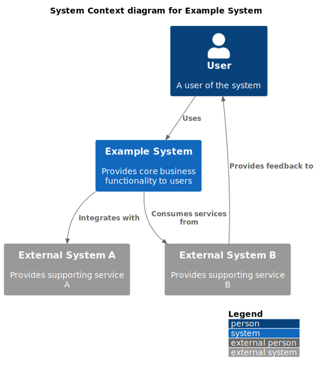

# Software Architecture Document

## Document Information
- **Project Name**: [Project Name]
- **Document Version**: [Version]
- **Last Updated**: [Date]
- **Prepared By**: [Name(s)]
- **Status**: [Draft/Reviewed/Approved]

## Table of Contents
1. [Introduction](#introduction)
2. [Architectural Representation](#architectural-representation)
3. [Architectural Goals and Constraints](#architectural-goals-and-constraints)
4. [Use Case View ("+1" View)](#use-case-view)
5. [Logical View](#logical-view)
6. [Process View](#process-view)
7. [Development View](#development-view)
8. [Physical View](#physical-view)
9. [Size and Performance](#size-and-performance)
10. [Quality Attributes](#quality-attributes)
11. [References](#references)

## Introduction
### Purpose
[Describe the purpose of this architecture document and its intended audience.]

### Scope
[Define the scope of this architecture document - what system(s) it covers and what it doesn't.]

### Definitions, Acronyms, and Abbreviations
[Provide a list of definitions, acronyms, and abbreviations used in the document.]

### References
[List any external documents referenced.]

### Overview
[Provide an overview of the document's contents and organization.]

## Architectural Representation
[Explain how the architecture is represented using the 4+1 View Model approach and how the views relate to each other.]

## Architectural Goals and Constraints
The architecture is designed to meet the following goals and constraints:

### Goals
- [Goal 1]
- [Goal 2]
- [Goal 3]
- [Goal 4]
- [Goal 5]

### Constraints
- [Constraint 1]
- [Constraint 2]
- [Constraint 3]
- [Constraint 4]
- [Constraint 5]

## Use Case View ("+1" View)
The use case view represents the key scenarios that the system must support.

### Key Use Cases
1. **[Use Case 1]**: [Brief description]
2. **[Use Case 2]**: [Brief description]
3. **[Use Case 3]**: [Brief description]
4. **[Use Case 4]**: [Brief description]
5. **[Use Case 5]**: [Brief description]

### Use Case Diagrams

*[Description of how this context diagram illustrates system interactions]*

## Logical View
The logical view describes the key functional elements of the system.

### Overview
[Provide a high-level description of the logical architecture.]

### Package/Component Architecture
The system is organized into the following key components:
- **[Component 1]**: [Brief description]
- **[Component 2]**: [Brief description]
- **[Component 3]**: [Brief description]
- **[Component 4]**: [Brief description]
- **[Component 5]**: [Brief description]

### Important Class Diagrams

*[Description of what this component diagram shows about the system structure]*

### State Machine Diagrams
[Describe the key state transitions for important system entities]

*[Description of what this state diagram represents]*

### Data Model
Key entities in the system include:
- [Entity 1]
- [Entity 2]
- [Entity 3]
- [Entity 4]
- [Entity 5]

*[Description of what this ER diagram shows about the data relationships]*

## Process View
The process view describes the system's dynamic aspects.

### Process Description
[Describe the key processes and workflows in the system]

*[Description of what this sequence diagram illustrates about process flow]*

### Thread Usage
[Describe how threading is used and managed.]

### Inter-Process Communication
[Describe the mechanisms used for communication between processes.]

### Process Diagrams

*[Description of what this container diagram shows about system interactions]*

## Development View
The development view describes the system from a programmer's perspective.

### Module Organization
[Describe the organization of software modules, their dependencies, and interfaces.]

### Common Design Patterns
[Describe any design patterns used consistently across the system.]

### Data Mapping Strategy
The system employs a data mapping strategy to ensure loose coupling between layers and components:

#### Mapping Principles
- **[Principle 1]**: [Description]
- **[Principle 2]**: [Description]
- **[Principle 3]**: [Description]
- **[Principle 4]**: [Description]

*[Description of the data mapping flow between system components]*

#### Data Mapping Tables

##### [Layer 1] to [Layer 2] Mappings

| Source Field | Target Field | Transformation |
|-------------|-------------|----------------|
| `Source.Field1` | `Target.Field1` | [Transformation description] |
| `Source.Field2` | `Target.Field2` | [Transformation description] |
| `Source.Field3` | `Target.Field3` | [Transformation description] |
| `Source.Field4` | `Target.Field4` | [Transformation description] |

##### [Layer 2] to [Layer 3] Mappings

| Source Field | Target Field | Type | Description |
|-------------|-------------|------|-------------|
| `Source.Field1` | `Target.Field1` | `Type` | [Description] |
| `Source.Field2` | `Target.Field2` | `Type` | [Description] |
| `Source.Field3` | `Target.Field3` | `Type` | [Description] |
| `Source.Field4` | `Target.Field4` | `Type` | [Description] |

#### Benefits
[Describe the benefits of the data mapping approach used]

### Development Standards
[Describe coding standards, tools, and other development conventions.]

### Package Diagrams
Component structure follows a layered architecture pattern:
- [Layer 1]
- [Layer 2]
- [Layer 3]
- [Layer 4]

*[Description of what this class diagram shows about the layered architecture]*

## Physical View
The physical view maps software to hardware infrastructure.

### Deployment Topology

*[Description of what this deployment diagram shows about the physical infrastructure]*

### Infrastructure Requirements
[Describe the infrastructure requirements of the system, such as servers, networks, and storage.]

### Deployment Diagram
[Describe how software is deployed onto hardware nodes]

### Deployment Strategy
The system is deployed using the following strategy:

*[Description of what this flowchart shows about the deployment strategy]*

## Size and Performance
### Response Time
[Describe expectations for system response times for key operations.]

### Throughput
[Describe the expected throughput requirements for the system.]

### Capacity
[Describe the capacity requirements of the system, such as number of concurrent users or data volume.]

### Resource Utilization
[Describe the expected utilization of computing resources.]

## Quality Attributes
### Security
[Describe the security features and mechanisms of the system.]

### Scalability
[Describe how the system can scale to meet growing demands.]

### Reliability & Availability
[Describe reliability and availability requirements and how they are addressed.]

### Maintainability
[Describe how the architecture supports system maintenance and evolution.]

### Interoperability
[Describe how the system interacts with other systems.]

## References
[List all documents referenced in this architecture document.]

## Appendices
### Appendix A: Decision Records
[Document key architectural decisions and their rationales.]

### Appendix B: Risk Assessment
[Provide risk assessment related to the architecture.]

### Appendix C: Performance Test Results
[Summarize performance test results if available.]
