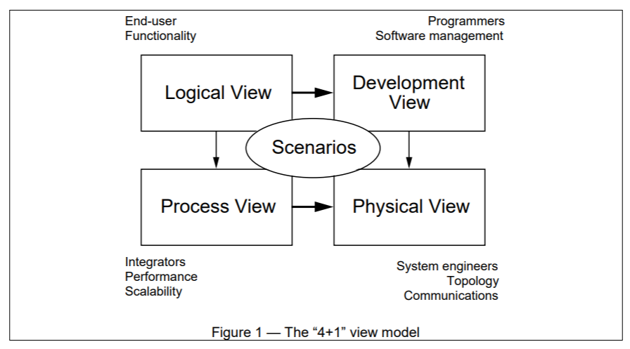

# 4+1 Architectural View Model Documentation

## Overview

This repository contains architectural documentation following the 4+1 Architectural View Model created by Philippe Kruchten, visualized using C4 Model diagrams implemented in PlantUML.

## What is the 4+1 Architectural View Model?

The 4+1 Architectural View Model is an approach for describing software architecture using multiple concurrent views:

1. **Logical View**: Describes the object model of the design (for designers)
2. **Process View**: Captures the concurrency and synchronization aspects (for integrators)
3. **Physical View**: Describes the mapping of software to hardware (for system engineers)
4. **Development View**: Describes the software's organization in the development environment (for programmers)
5. **Scenarios ("+1")**: Illustrates how the four views work together (for all stakeholders)

Each view addresses specific concerns of different stakeholders in the software development process, providing a comprehensive understanding of the system architecture.



## Project Structure

This repository contains:

- [4+1 Architecture Template](4plus1_architecture_template.md) - A template document for creating your own 4+1 architecture documentation
- [Order Management System Architecture](order_system_architecture.md) - A complete example implementation for an Order Management System
- [PlantUML Diagrams](diagrams/) - C4 Model diagrams in PlantUML format

## C4 Model Diagramming

The [C4 model](https://c4model.com/) is a technique for visualizing software architecture at different levels of abstraction:

1. **Context** - System context and external dependencies
2. **Container** - High-level technology decisions and how responsibilities are distributed
3. **Component** - Components within containers and their interactions
4. **Code** - How components are implemented

This project uses PlantUML with the C4 extension to create standardized architecture diagrams.

## Azure-PlantUML for Cloud Architecture

This project also demonstrates how to use [Azure-PlantUML](https://github.com/plantuml-stdlib/Azure-PlantUML) for creating Azure cloud architecture diagrams, as shown in the deployment diagrams.

## Environment Setup

### Prerequisites

1. Visual Studio Code
2. [PlantUML extension for VS Code](https://marketplace.visualstudio.com/items?itemName=jebbs.plantuml)
3. Java Runtime Environment (JRE)
4. Graphviz (optional, for local rendering)

### Installation Steps

1. Install VS Code from https://code.visualstudio.com/
2. Install the PlantUML extension from VS Code marketplace
3. Install Java (required by PlantUML): https://www.java.com/en/download/
4. Install Graphviz (optional): https://graphviz.org/download/

### VS Code Configuration

Add these settings to your VS Code configuration:

```json
{
  "plantuml.exportFormat": "svg",
  "plantuml.server": "https://www.plantuml.com/plantuml",
  "plantuml.render": "PlantUMLServer"
}
```

## Generating Diagrams

### Using VS Code PlantUML Extension

1. Open any `.puml` file in the diagrams directory
2. Right-click in the editor and select "Preview Current Diagram" to see a preview
3. To export the diagram as SVG:
   - Use Alt+D to preview
   - Right-click in the preview and select "Export diagram"
   - Choose SVG format and save to the desired location (usually in an `out/diagrams/` directory)

### Command-Line Generation

You can also generate diagrams using the PlantUML JAR:

```bash
java -jar plantuml.jar -tsvg diagrams/*.puml -o ../out/diagrams/
```

## Using Mermaid for Additional Diagrams

The documentation also includes Mermaid diagrams embedded directly in Markdown. These can be viewed in any Markdown renderer that supports Mermaid (like GitHub, GitLab, or VS Code with the Markdown Preview Enhanced extension).

## References

- [4+1 Architectural View Model (Kruchten)](https://www.cs.ubc.ca/~gregor/teaching/papers/4+1view-architecture.pdf)
- [C4 Model](https://c4model.com/)
- [PlantUML](https://plantuml.com/)
- [PlantUML C4 Macros](https://github.com/plantuml-stdlib/C4-PlantUML)
- [Azure PlantUML](https://github.com/plantuml-stdlib/Azure-PlantUML)
- [Mermaid Diagramming](https://mermaid.js.org/)
- [Rational Unified Process](https://en.wikipedia.org/wiki/Rational_Unified_Process)
