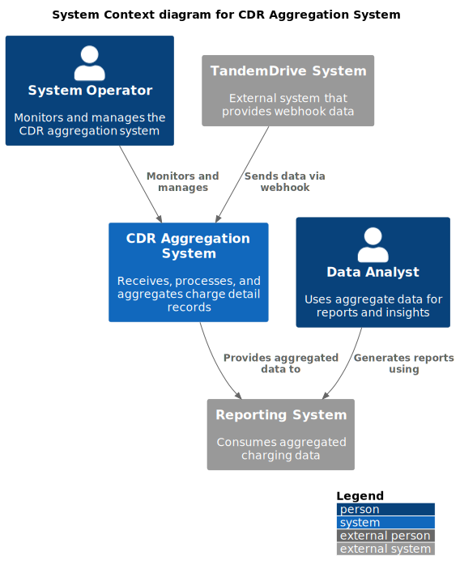
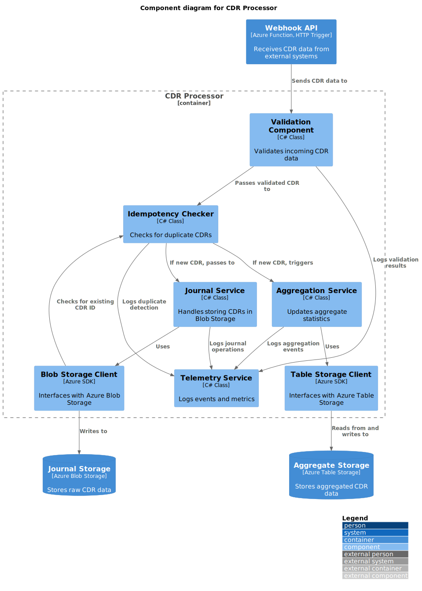
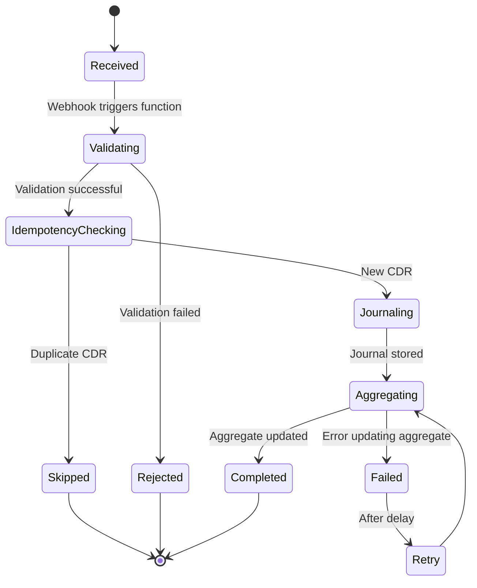
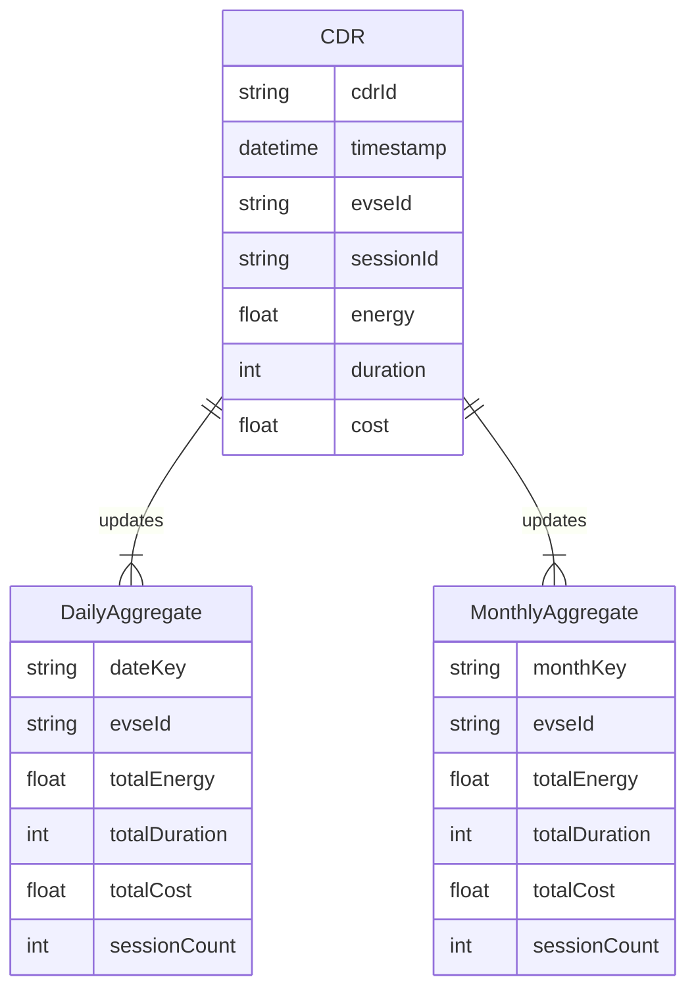
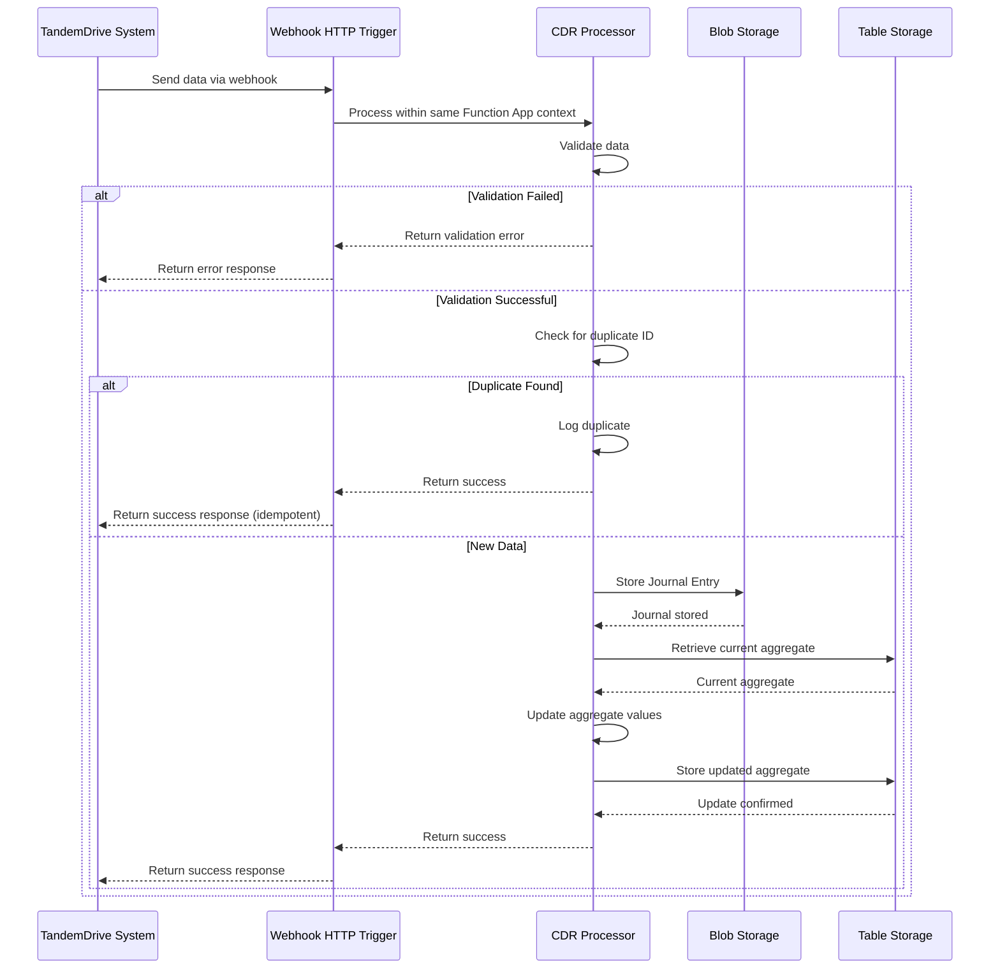
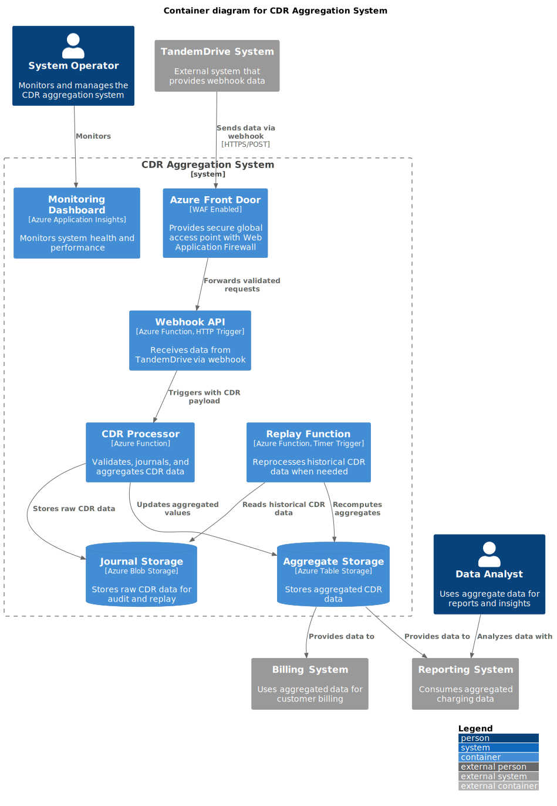
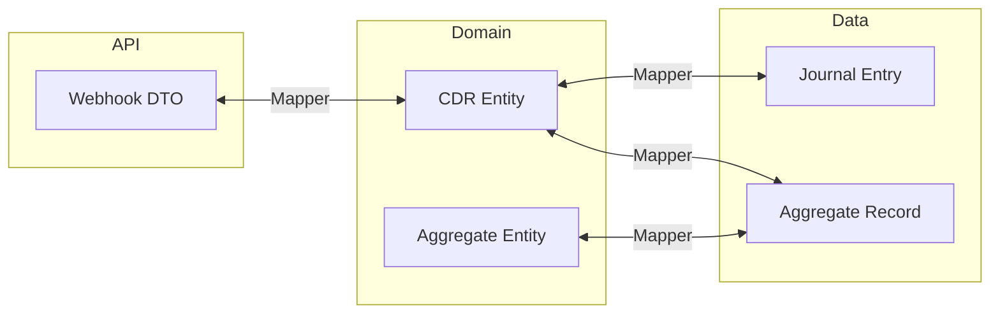
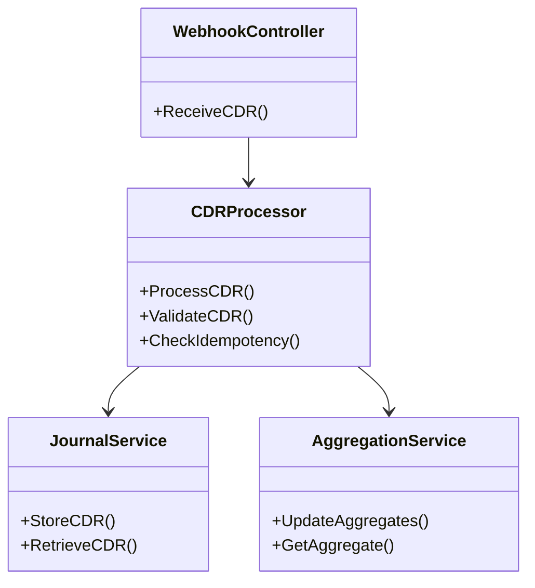
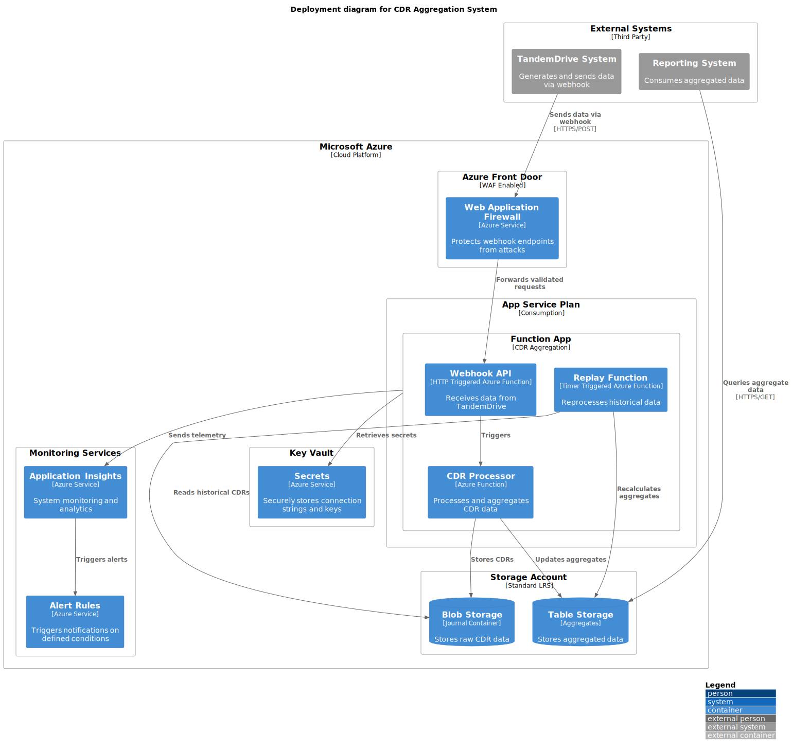
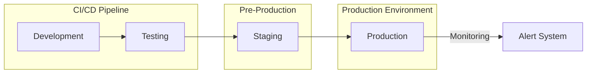

# Software Architecture Document: CDR Aggregation System

## Document Information
- **Project Name**: CDR Aggregation System
- **Document Version**: 1.0
- **Last Updated**: 28-04-2025
- **Prepared By**: Solution Architect Team
- **Status**: Draft

## Table of Contents
1. [Introduction](#introduction)
2. [Architectural Representation](#architectural-representation)
3. [Architectural Goals and Constraints](#architectural-goals-and-constraints)
4. [Use Case View ("+1" View)](#use-case-view)
5. [Logical View](#logical-view)
6. [Process View](#process-view)
7. [Development View](#development-view)
8. [Physical View](#physical-view)
9. [Size and Performance](#size-and-performance)
10. [Quality Attributes](#quality-attributes)
11. [References](#references)

## Introduction
### Purpose
This architecture document describes the design decisions and structure of the CDR Aggregation System. It is intended for technical stakeholders including developers, testers, system administrators, and technical managers involved in the development, deployment, and maintenance of the system.

### Scope
This document covers the architecture of the CDR Aggregation System, including webhook integration for data ingestion, Azure Functions for data processing and aggregation, and Azure Blob Storage for data persistence and replay capabilities. It does not cover client applications that may consume aggregated data.

### Definitions, Acronyms, and Abbreviations
- **CDR**: Charge Detail Record - record of a charging session containing details like energy consumed and duration
- **EVSE**: Electric Vehicle Supply Equipment (charging station)
- **Idempotency**: Property where an operation can be performed multiple times without changing the result
- **RU/s**: Request Units per second (Cosmos DB throughput unit)
- **Webhook**: HTTP callback that delivers data to other applications in real-time

### References
- Azure Functions Documentation
- Azure Blob Storage Documentation
- Azure Cosmos DB Documentation
- Azure Event Grid Documentation

### Overview
The remainder of this document describes the architecture using the 4+1 View Model approach, covering logical, process, development, and physical views, as well as key scenarios.

## Architectural Representation
This architecture is represented using the 4+1 View Model approach:
- **Logical View**: Describes the functional elements and their relationships
- **Process View**: Focuses on dynamic aspects of the system including concurrency and synchronization
- **Development View**: Addresses how the software is organized for development
- **Physical View**: Maps software to hardware and describes system deployment
- **Scenarios (+1 View)**: Illustrates how the architecture elements work together to fulfill key requirements

C4 model diagrams are used throughout the document to visualize these views at different levels of abstraction.

## Architectural Goals and Constraints
The architecture is designed to meet the following goals and constraints:

### Goals
- Ensure accurate and reliable processing of charge detail records (CDRs)
- Provide idempotent processing to handle duplicate data submissions
- Maintain a complete journal of all received CDRs for auditing and replay
- Support aggregation of CDR data for reporting and analysis
- Allow for system recovery through data replay when needed
- Optimize for cost-efficiency in data storage

### Constraints
- The system must run on Microsoft Azure platform
- Must integrate with third-party systems via webhooks
- Must process CDRs in near real-time
- System must be compliant with data retention policies
- Storage solution must optimize cost while meeting performance requirements

## Use Case View ("+1" View)
The use case view represents the key scenarios that the system must support.

### Key Use Cases
1. **Receive CDR Data**: System receives CDR data from external sources via webhook
2. **Process CDR**: System validates, stores, and aggregates CDR data
3. **Handle Duplicate CDRs**: System identifies and handles duplicate CDR submissions
4. **Generate Aggregated Reports**: System provides aggregated views of CDR data
5. **Replay Historical Data**: System can replay historical data for recomputing aggregates

### Use Case Diagrams

*This context diagram shows how the CDR Aggregation System interacts with external systems and users. It receives CDR data from external providers and makes aggregated data available to reporting systems and users.*

## Logical View
The logical view describes the key functional elements of the system.

### Overview
The CDR Aggregation System is composed of three primary components:
1. Webhook Integration - Receives data from TandemDrive via webhook
2. CDR Processing & Aggregation - Azure Function that processes, validates, and aggregates CDR data
3. Data Storage - Persistent storage for both raw CDR data and aggregated results

### Package/Component Architecture
The system is organized into the following key components:
- **Webhook Endpoint**: HTTP endpoint that receives data from TandemDrive system
- **Validation Service**: Validates incoming data for completeness and correctness
- **Idempotency Check**: Ensures duplicate data is not processed twice
- **Journal Service**: Stores raw data in Blob Storage for auditing and replay
- **Aggregation Service**: Updates aggregated statistics based on incoming data
- **Storage Manager**: Manages interactions with different storage services

*This component diagram shows the internal structure of the CDR Processing & Aggregation Azure Function, including the validation, idempotency, journaling, and aggregation components.*

### State Machine Diagrams
The CDR processing workflow follows these states:

*This state diagram represents the processing flow of a CDR through the system, showing the validation, idempotency check, journaling, and aggregation steps.*

### Data Model
Key entities in the system include:
- CDR (Charge Detail Record)
- Daily Aggregate
- Monthly Aggregate
- EVSE (Electric Vehicle Supply Equipment)
- Session

*This ER diagram shows the relationship between CDRs and the aggregates they update. Each CDR contributes to both daily and monthly aggregates.*

## Process View
The process view describes the system's dynamic aspects.

### Process Description
When data is received via webhook from TandemDrive, the following process is triggered:

*This sequence diagram illustrates the process flow when data is received from TandemDrive through a webhook HTTP trigger, then processed within the same Azure Function App context for validation, idempotency checking, journaling, and aggregation.*

### Thread Usage
The system uses a single Azure Function App with multiple triggers, which share the same execution context:

- **HTTP Trigger**: Handles webhook requests from TandemDrive
- **Timer Trigger**: Executes the replay functionality on a schedule
- **Event Trigger**: (Optional) Could be used for additional asynchronous processing

Each function execution instance is isolated and can scale horizontally as needed, with Azure Functions automatically managing resource allocation.

### Inter-Process Communication
- **External to Azure Function**: HTTP request/response for webhook data ingestion
- **Within Azure Function**: Direct method calls between components in the same context
- **Azure Function to Storage**: Azure SDK APIs for Blob and Table Storage access

### Process Diagrams

*This container diagram shows the major components of the system including the webhook integration, Azure Function with multiple triggers, and storage services, illustrating how they interact.*

## Development View
The development view describes the system from a programmer's perspective.

### Module Organization
The system is organized into modules within a single Azure Function App:
- **API Layer**: HTTP-triggered webhook endpoint
- **Processing Layer**: Core processing components shared across triggers
  - Validation
  - Idempotency
  - Journaling
  - Aggregation
- **Domain Layer**: Core business logic and domain models
- **Data Layer**: Storage access and data operations
- **Common**: Shared utilities, models, and interfaces

### Common Design Patterns
- **Repository Pattern**: For data access abstraction
- **Strategy Pattern**: For different storage implementations
- **Decorator Pattern**: For cross-cutting concerns like logging
- **Command Pattern**: For processing operations

### Data Mapping Strategy
The system employs a data mapping strategy to ensure loose coupling between layers and components:

#### Mapping Principles
- **Domain Independence**: Domain models are independent of data storage models
- **Explicit Mapping**: All transformations between layers are explicit
- **Rich Domain Model**: Business rules reside in domain models
- **Thin Repository Layer**: Data access layer only handles CRUD operations

*This diagram illustrates how data flows between the different layers of the system, with explicit mapping between each layer.*

#### Data Mapping Tables

##### Webhook DTO to Entity Mappings

| Source Field | Target Field | Transformation |
|-------------|-------------|----------------|
| `id` | `recordId` | Direct mapping |
| `occurred_at` | `timestamp` | Parse to DateTime |
| `data.id` | `entityId` | Direct mapping |
| `kind` | `recordType` | Direct mapping |
| `data.name` | `name` | Direct mapping |
| `data.country` | `country` | Direct mapping |
| `modification_kind` | `changeType` | Direct mapping |

#### Benefits
The data mapping approach provides clear boundaries between layers, allowing each layer to evolve independently. It also facilitates testing and ensures that data transformation requirements are explicitly documented.

### Development Standards
- Code follows C# / .NET coding standards
- Azure Functions use isolated process model
- Dependency injection for components
- Unit tests required for all business logic
- Integration tests for storage operations

### Package Diagrams
Component structure follows a layered architecture pattern:
- API Layer (Webhook Controllers)
- Service Layer (Validation, Idempotency, Aggregation)
- Domain Layer (Business Logic, Models)
- Data Layer (Storage Access)

*This class diagram shows the layered architecture of the system, with clear separation between the webhook controller, processing logic, and storage services.*

## Physical View
The physical view maps software to hardware infrastructure.

### Deployment Topology

*This deployment diagram shows how the CDR Aggregation System components are deployed on Azure infrastructure, including Azure Front Door with WAF protection, the Azure Function App, Blob Storage, and Table Storage.*

### Infrastructure Requirements
- **Azure Front Door**: With WAF enabled for secure global ingress
- **Azure Function App**: Consumption plan for cost optimization
- **Azure Blob Storage**: For CDR journal storage
  - Optimized for append-only journal pattern
  - Cost-efficient for sequential storage
  - Hierarchical namespace for time-based organization
- **Azure Table Storage**: For aggregates (or Cosmos DB for higher scale)
  - Optimized for structured aggregate data
  - Better query capabilities for aggregate retrieval
  - Lower cost for frequent reads/writes of small records
- **Azure Application Insights**: For monitoring and alerting
- **Azure Key Vault**: For secure storage of secrets and configuration
- **Azure Event Grid** (optional): For advanced event routing

### Storage Strategy and Cost Analysis
The system employs different storage solutions optimized for specific use cases:

#### Journal Storage (Blob Storage)
- **Use Case**: Raw CDR data storage in append-only pattern
- **Organization**: `/cdr-journal/{yyyy}/{MM}/{dd}/{HH}/{cdrId}.json`
- **Benefits**:
  - Ideal for append-only logs/journals
  - Cost-effective for large datasets
  - Simple folder hierarchy for time-based data organization
  - Native support for content-based addressing (using cdrId as filename)

#### Aggregate Storage (Table Storage)
- **Use Case**: Structured aggregation results by time period and EVSE
- **Organization**: Partition key strategy using time periods
- **Benefits**:
  - Efficient retrieval of aggregated data by time period
  - Better query capabilities for reporting
  - Optimized for small, structured data records
  - Cost-effective for frequent access patterns

#### Cost Comparison (7.2 Million CDRs/year at 10KB per CDR)

| Storage Type     | Annual Storage (GB) | Annual Storage Cost | Annual Write Cost | Total Annual Cost |
|------------------|---------------------|---------------------|-------------------|-------------------|
| **Blob Storage** | ~69 GB              | $1.27               | $3.60             | **~$4.87**        |
| Table Storage    | ~69 GB              | $3.45               | $0.26             | ~$3.71            |
| Cosmos DB        | ~69 GB              | $17.25              | ~$104*            | ~$121             |

\* Cosmos DB cost based on required throughput of ~150 RU/s

Based on this analysis, the architecture uses:
- **Blob Storage** for journal data (raw CDRs) - optimized for append-only pattern
- **Table Storage** for aggregate data - optimized for structured queries

### Deployment Strategy
The system is deployed using the following strategy:

*This flowchart illustrates the deployment pipeline from development through to production, with appropriate testing at each stage.*

## Size and Performance
### Response Time
- Webhook endpoint responds within 200ms for 95% of requests
- CDR processing completes within 1 second for 95% of requests
- Aggregate queries respond within 500ms for 95% of requests

### Throughput
- System handles up to 100 CDRs per second during peak load
- Approximately 7.2 million CDRs per year (20,000 per day)

### Capacity
- Storage requirements: ~69 GB per year based on 10KB per CDR
- Azure Functions scale automatically to handle load fluctuations

### Resource Utilization
- Azure Function: Consumption plan with auto-scaling
- Blob Storage: Standard tier with lifecycle management
- Table Storage: Standard tier or Cosmos DB for higher scale requirements

## Quality Attributes
### Security
- All APIs secured with Azure AD or API key authentication
- Secrets stored in Azure Key Vault
- All data at rest encrypted
- All communications over HTTPS

### Scalability
- Azure Functions scale automatically based on load
- Storage partitioning strategy for Table Storage/Cosmos DB to avoid hot spots
- Optional Cosmos DB multi-region deployment for global scale

### Reliability & Availability
- Target availability: 99.9% (3 nines)
- Idempotent processing to handle duplicate submissions
- Complete journal of all received data for recovery/replay
- Monitoring and alerting for system health

### Maintainability
- Modular design with clear separation of concerns
- Comprehensive logging for troubleshooting
- Configuration-driven behaviors where possible
- Well-documented code and architecture

### Interoperability
- REST-based webhook interface for data ingestion
- Standard Azure SDK interfaces for storage
- Optional API for external access to aggregated data

## References
- Azure Functions Documentation
- Azure Blob Storage Documentation and Best Practices
- Azure Cosmos DB Documentation
- Webhook Best Practices

## Appendices
### Appendix A: Decision Records
#### ADR 1: Blob Storage for CDR Journal
Selected Azure Blob Storage for CDR journaling due to:
- Cost efficiency (~$4.87/year vs $121/year for Cosmos DB)
- Natural fit for append-only journal pattern
- Hierarchical namespace support for time-based organization
- Simple integration with Azure Functions
- Superior performance for sequential write operations
- Support for lifecycle management policies to archive older data automatically

While Table Storage offers a slightly lower total cost (~$3.71/year vs $4.87/year), Blob Storage was selected for the journal pattern because:
1. Better support for the time-based folder structure needed for replay scenarios
2. Lower storage cost per GB ($1.27 vs $3.45)
3. More natural fit for storing JSON documents with varying schema
4. Better tools for bulk data operations like replay processing

#### ADR 2: Table Storage for Aggregates
Selected Azure Table Storage for aggregate data storage due to:
- Cost efficiency (~$3.71/year) compared to Cosmos DB (~$121/year)
- Structured query capabilities needed for reporting functions
- Better indexing for the types of queries performed on aggregates
- Partition key design allows efficient retrieval by time period
- Simple transaction model for updating aggregate values
- Sufficient performance for the expected query patterns

The slight additional cost compared to using Blob Storage for everything is justified by the significant improvement in query capabilities and structured data access.

#### ADR 3: Idempotency Strategy
Implemented file-based idempotency checking using CDR ID as unique identifier because:
- Leverages existing blob storage
- Simple to implement and maintain
- Sufficient performance for expected load

#### ADR 4: Azure Front Door with WAF for API Security and Global Access
Selected Azure Front Door with WAF for the webhook ingress layer due to:

- **Security Considerations**: 
  - Built-in Web Application Firewall (WAF) protects webhook endpoints from common attacks
  - DDoS protection included
  - SSL termination and certificate management

- **Performance Benefits**:
  - Global edge network improves response times
  - Built-in load balancing capabilities

- **Cost Efficiency**: 
  - Significant cost savings compared to Azure API Management

##### Cost Comparison (7.2 Million 10KB Ingestions per Year)

| Service                   | Estimated Annual Cost         | Key Features                            | Suitable For                    |
|---------------------------|-------------------------------|-----------------------------------------|---------------------------------|
| **Azure Front Door**      | ~$35 base/month + ~$0.0075/GB data + $0.25/million requests | Global load balancing, SSL, basic WAF | Cost-effective external access  |
| **Azure API Management (Developer)** | ~$150/month                   | Basic API gateway, limited scale         | Development & Testing only      |
| **Azure API Management (Standard)**  | ~$700+/month                  | API gateway, policies, advanced security | Enterprise-grade API exposure   |
| **Azure API Management (Premium)**   | ~$2750+/month                 | Multi-region, VNET, advanced capabilities | High-scale, mission-critical APIs |

##### Cost Calculation (Approximate Annual):
- **Front Door**:
  - 7.2M requests/year = $1.80/year
  - 72 GB data/year (7.2M x 10KB) = ~$0.54/year
  - Base cost: ~$420/year
  - Total: ~$422.34/year

- **APIM (Standard)**:
  - Fixed cost: ~$8,400/year minimum

- **APIM (Premium)**:
  - Fixed cost: ~$33,000/year minimum

##### Decision Rationale

For this specific CDR ingestion use case, Azure Front Door with WAF was selected because:

1. **Cost-effectiveness**: Approximately $422/year versus $8,400/year for APIM Standard
2. **Sufficient capabilities**: The webhook ingestion pattern doesn't require advanced API policies
3. **Security requirements**: Front Door's WAF provides adequate protection for the webhook endpoints
4. **Global access**: Front Door's global edge network ensures optimal performance for the TandemDrive integration

Azure API Management would be reconsidered if future needs require:
- Complex API transformations
- Sophisticated throttling policies
- Developer portal functionality
- API versioning beyond basic capabilities
- Advanced authentication schemes

This decision saves approximately $8,000 per year in infrastructure costs while meeting all security and performance requirements.

### Appendix B: Risk Assessment
| Risk | Impact | Likelihood | Mitigation |
|------|--------|------------|------------|
| Data duplication | Medium | High | Idempotency check based on cdrId |
| Data loss | High | Low | Journal storage with retention policy |
| Performance bottlenecks | Medium | Medium | Auto-scaling Azure Functions and performance testing |
| Cost overruns | Medium | Low | Storage selection optimized for cost, monitoring |

### Appendix C: Performance Test Results
Preliminary load testing indicates:
- Webhook can handle 150 requests/second (50% above requirement)
- Average processing time of 450ms per CDR
- Storage operations account for 70% of processing time
