# Software Architecture Document: E-Learning Community Platform

## Document Information
- **Project Name**: E-Learning Community Platform
- **Document Version**: 1.0
- **Last Updated**: 2023-06-15
- **Prepared By**: Architecture Team
- **Status**: Draft

## Table of Contents
1. [Introduction](#introduction)
2. [Architectural Representation](#architectural-representation)
3. [Architectural Goals and Constraints](#architectural-goals-and-constraints)
4. [Use Case View ("+1" View)](#use-case-view)
5. [Logical View](#logical-view)
6. [Process View](#process-view)
7. [Development View](#development-view)
8. [Physical View](#physical-view)
9. [Size and Performance](#size-and-performance)
10. [Quality Attributes](#quality-attributes)
11. [References](#references)

## Introduction
### Purpose
This architecture document describes the design decisions and structure of the E-Learning Community Platform. It is intended to provide a comprehensive view of the system's architecture for technical stakeholders, including developers, testers, and system administrators, as well as for business stakeholders who need to understand the system's capabilities and constraints.

### Scope
This document covers the complete architectural design of the E-Learning Community Platform, including:
- Web application front-end (Blazor WebAssembly)
- GraphQL API backend (Hot Chocolate)
- Learning content management
- Assignment management
- Forum functionality
- Certification system
- Integration with external systems (YouTube, calendar services, etc.)

It does not cover detailed UI design, content creation guidelines, or business processes outside the system.

### Definitions, Acronyms, and Abbreviations
- **GraphQL**: A query language for APIs and a runtime for executing those queries
- **Hot Chocolate**: .NET implementation of GraphQL
- **Blazor**: A web framework for building interactive web UIs using C# instead of JavaScript
- **WASM**: WebAssembly
- **Learning Path**: A structured sequence of educational content and activities
- **Module**: A discrete unit of content within a learning path
- **CDR**: Course Completion Rate
- **LMS**: Learning Management System

### References
- .NET 9 Documentation
- Blazor WebAssembly Documentation
- Hot Chocolate GraphQL Documentation
- Azure Services Documentation
- C4 Model for Software Architecture

### Overview
The remainder of this document is organized according to the 4+1 architectural view model, covering logical, process, development, and physical views, as well as key use case scenarios.

## Architectural Representation
The architecture is represented using the 4+1 View Model approach:

- **Logical View**: Describes the functional elements and their relationships
- **Process View**: Focuses on dynamic aspects of the system, including concurrency and synchronization
- **Development View**: Addresses software organization during development
- **Physical View**: Maps software to hardware and describes system deployment
- **Use Case View ("+1")**: Illustrates key scenarios that tie together the other four views

We use C4 model diagrams (Context, Container, Component, Deployment) to visualize different aspects of the architecture across these views.

## Architectural Goals and Constraints
The architecture is designed to meet the following goals and constraints:

### Goals
- Create a scalable platform that supports thousands of concurrent users
- Enable content creators to build structured learning paths with modules and assignments
- Provide a forum for community discussion and knowledge sharing
- Support integration with YouTube videos as learning resources
- Enable assignment submission, review, and grading
- Support scheduling of learning paths as events with start and end dates
- Provide certification mechanisms based on completion criteria
- Create a responsive, performant user experience across devices

### Constraints
- System must be built using .NET 9, Hot Chocolate GraphQL, and Blazor WebAssembly
- System must be deployable on Microsoft Azure cloud platform
- System must be accessible on modern web browsers without plugins
- System must comply with data protection regulations
- System must integrate with existing authentication systems
- Initial rollout must support at least 5,000 concurrent users
- Development timeline is constrained to 9 months for initial release

## Use Case View ("+1" View)
The use case view represents the key scenarios that the system must support.

### Key Use Cases
1. **Create Learning Path**: Content creators design structured learning paths with modules, content, and assignments
2. **Enroll in Learning Path**: Learners browse and enroll in available learning paths
3. **Submit and Review Assignments**: Learners submit assignments that are reviewed and graded by reviewers
4. **Participate in Forum Discussions**: Users engage in discussions related to learning content
5. **Schedule Learning Events**: Content creators schedule learning paths as events with specific dates
6. **Earn Certification**: Learners complete requirements and receive certification
7. **Track Learning Progress**: Learners and content creators monitor progress through learning paths
8. **Manage Learning Content**: Content creators integrate YouTube videos and other learning resources

### Use Case Diagrams
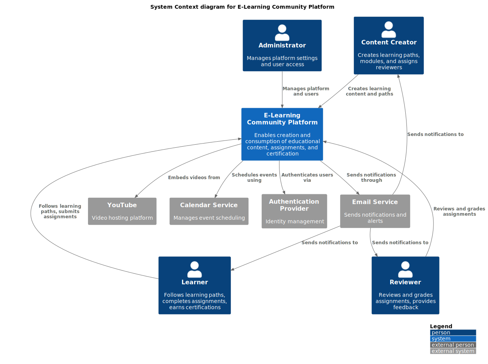

*This context diagram shows how different users interact with the E-Learning Community Platform and how the platform interacts with external systems like YouTube, calendar services, and email providers.*

#### Context Diagram Detailed Description
The context diagram illustrates the highest-level view of the E-Learning Community system, showing four primary types of users and four external systems. 

The user types represent distinct roles within the platform:
- **Content Creators** are responsible for building educational content, organizing learning paths, and assigning reviewers to grade submissions. They are the educational content providers.
- **Learners** represent the primary consumers of the platform, who enroll in courses, complete assignments, and work toward certifications.
- **Reviewers** have the specialized role of evaluating and grading assignments submitted by learners, providing feedback, and determining if certification requirements have been met.
- **Administrators** manage the overall platform settings, user access controls, and system configuration.

The diagram shows these users directly interacting with the E-Learning Community Platform through different types of relationships:
- Content Creators create and manage educational content
- Learners consume content and submit assignments
- Reviewers evaluate assignments and provide feedback
- Administrators oversee platform operation

The platform itself integrates with four external systems:
1. **YouTube** - For embedding educational video content created by third parties
2. **Calendar Service** - For scheduling learning events, managing course start/end dates
3. **Email Service** - For sending notifications about assignments, reviews, deadlines
4. **Authentication Provider** - For identity management and access control

The diagram shows bidirectional communication between the platform and these external systems, with the email service also having direct communication paths to the three main user types for notifications. This emphasizes how the platform serves as a central hub connecting educational content creators, consumers, and evaluators while leveraging external services to provide a complete learning experience.

## Logical View
The logical view describes the key functional elements of the system.

### Overview
The E-Learning Community Platform is composed of several core functional areas:

1. **Learning Content Management**: Creating and organizing learning paths, modules, and content
2. **Assignment System**: Submission, review, and grading of assignments
3. **Forum System**: Community discussions and knowledge sharing
4. **Event Management**: Scheduling learning paths as events with start/end dates
5. **Certification System**: Tracking progress and issuing certifications
6. **User Management**: Profiles, roles, and permissions

These functional areas are implemented through a set of microservices that expose their functionality via a unified GraphQL API.

### Package/Component Architecture
The system is organized into the following key components:

- **Web Application**: Blazor WebAssembly front-end for user interaction
- **GraphQL API**: Hot Chocolate implementation providing a unified API
- **Learning Service**: Manages learning paths, modules, and content
- **Assignment Service**: Handles assignment workflows
- **Forum Service**: Provides discussion functionality
- **Certification Service**: Manages certification requirements and issuance
- **Notification Service**: Handles system notifications
- **Storage Services**: Manages file storage and database access

### Important Class Diagrams
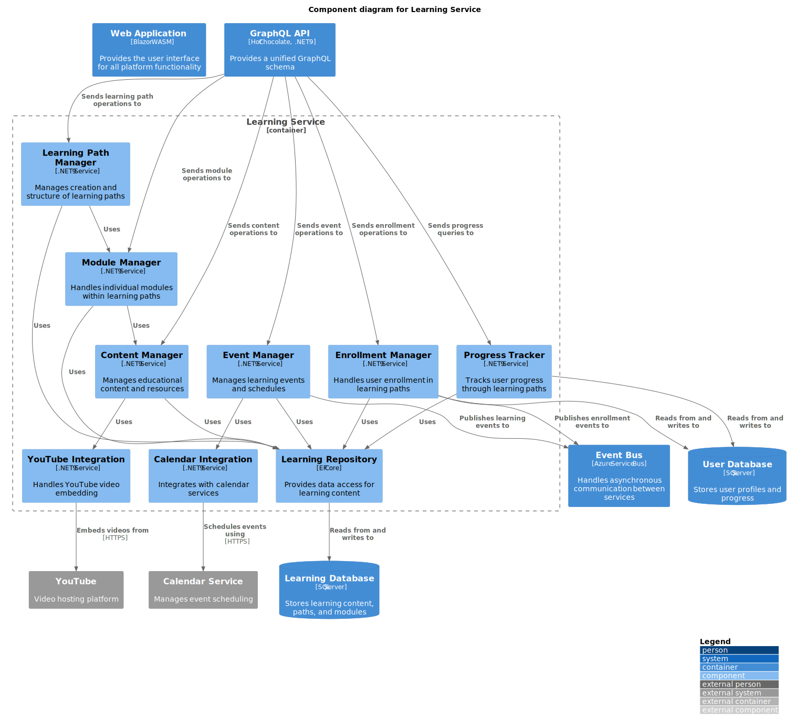

*This component diagram shows the internal structure of the Learning Service, which is responsible for managing learning paths, modules, content, and integration with external systems like YouTube and calendar services.*

#### Component Diagram Detailed Description
This component diagram zooms in on the internal architecture of the Learning Service, which is the core service responsible for managing educational content within the platform. It reveals a well-structured service with clear separation of concerns and specialized components for different aspects of learning management.

The diagram shows the Learning Service containing eight distinct components:
1. **Learning Path Manager** - The central component for creating and structuring entire learning paths
2. **Module Manager** - Handles the management of individual modules within learning paths
3. **Content Manager** - Focuses on educational content resources management
4. **Calendar Integration** - Provides integration with external calendar services
5. **YouTube Integration** - Handles embedding of YouTube videos within the learning content
6. **Event Manager** - Manages scheduled learning events and their timelines
7. **Enrollment Manager** - Controls user enrollment in learning paths
8. **Progress Tracker** - Monitors and records learner progress through courses
9. **Learning Repository** - The data access layer for all learning content

The diagram illustrates the dependencies between these components through relationship arrows:
- The Learning Path Manager depends on the Module Manager, showing the hierarchical relationship between paths and modules
- The Module Manager depends on the Content Manager, indicating that modules consist of content items
- The Event Manager utilizes the Calendar Integration component for scheduling functionality
- The Content Manager uses the YouTube Integration component to embed video content

External to the Learning Service, the diagram shows related containers:
- The GraphQL API, which delegates operations to the Learning Path Manager and other resolvers
- The Database that stores all learning content and structure
- External systems (YouTube and Calendar Service) that the Learning Service integrates with
- An Event Bus that receives learning and enrollment events

The repository pattern is evident with the Learning Repository serving as an abstraction layer between domain components and the database. The diagram clearly shows how the Learning Service maintains its internal cohesion while providing integration points with the rest of the system.

### State Machine Diagrams
The learning path lifecycle follows these states:

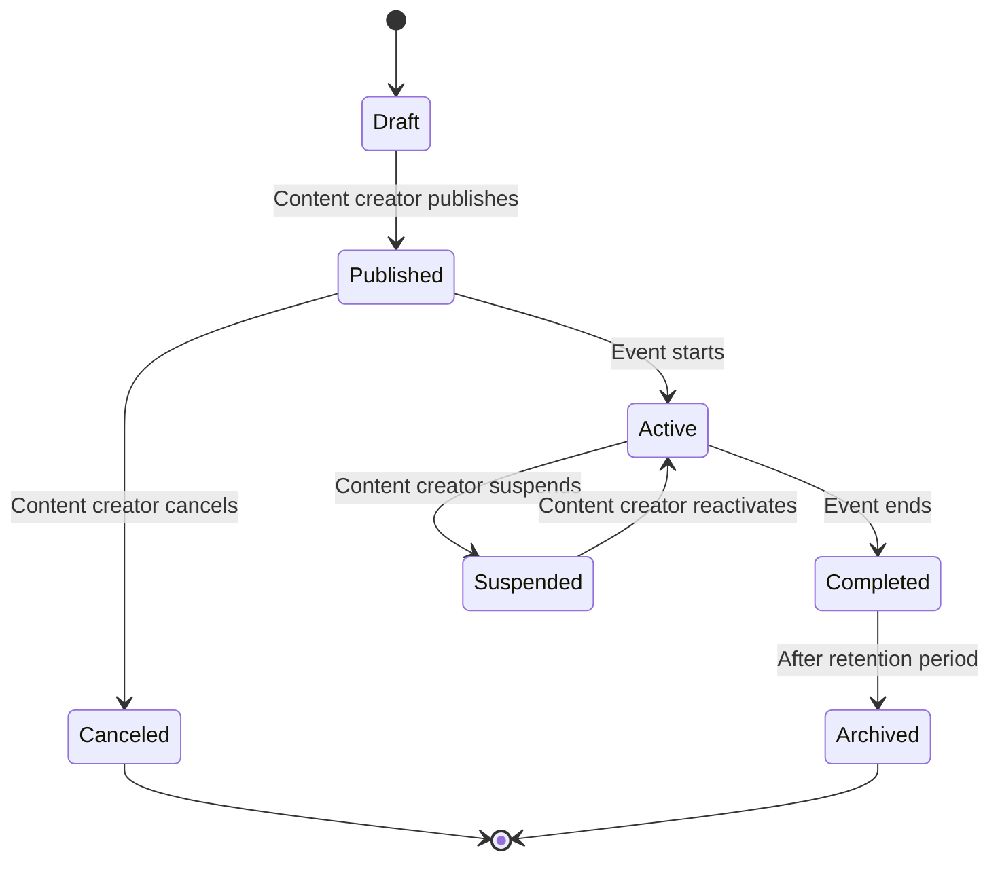

*This state diagram represents the lifecycle of a learning path, from creation through publication, activation, completion, and eventual archiving.*

The assignment workflow follows these states:

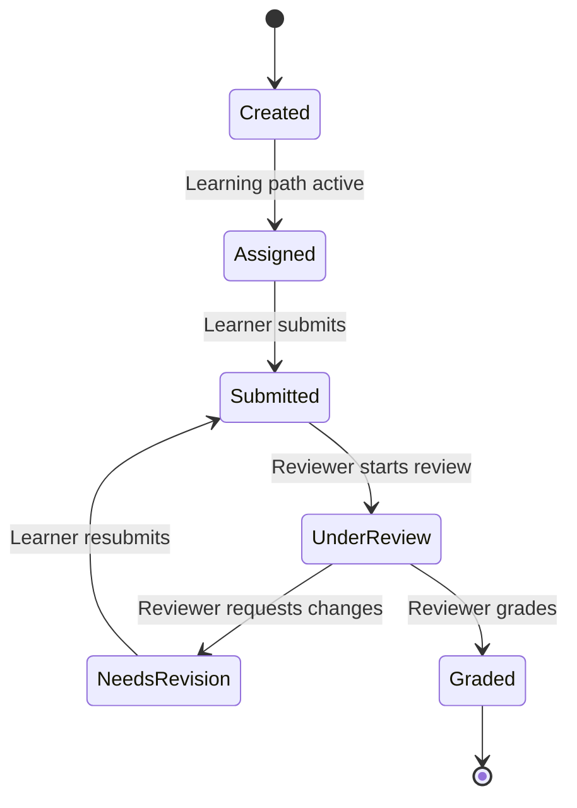

*This state diagram represents the assignment workflow from creation through submission, review, and grading.*

### Data Model
Key entities in the system include:
- User
- LearningPath
- Module
- Content
- Assignment
- Submission
- Forum
- Topic
- Post
- Event
- Certification

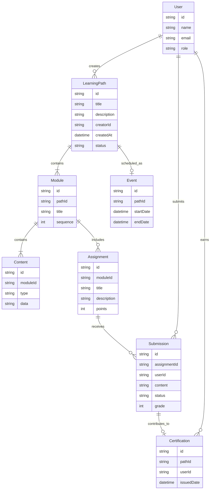

*This ER diagram shows the relationships between key entities in the system. Users create learning paths that contain modules, which in turn contain content and assignments. Learners submit assignment solutions that contribute toward earning certifications.*

## Process View
The process view describes the system's dynamic aspects.

### Process Description
The system involves several key processes that demonstrate how components interact to fulfill user needs. Below are the main process workflows:

#### 1. Assignment Submission Process

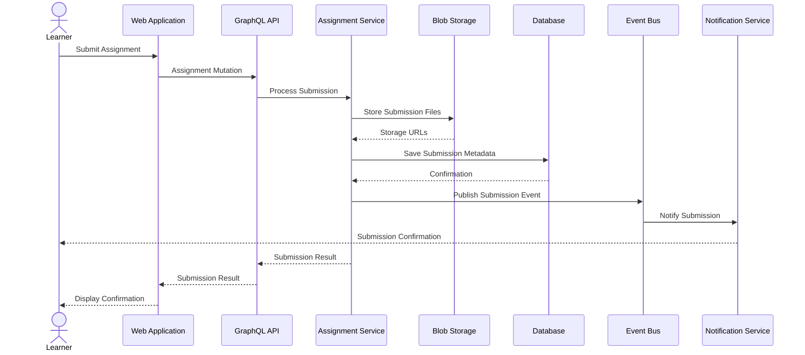

*This sequence diagram illustrates the process flow when a learner submits an assignment. The submission is processed through the GraphQL API, stored in blob storage, recorded in the database, and relevant notifications are sent.*

#### 2. Learning Path Creation Process

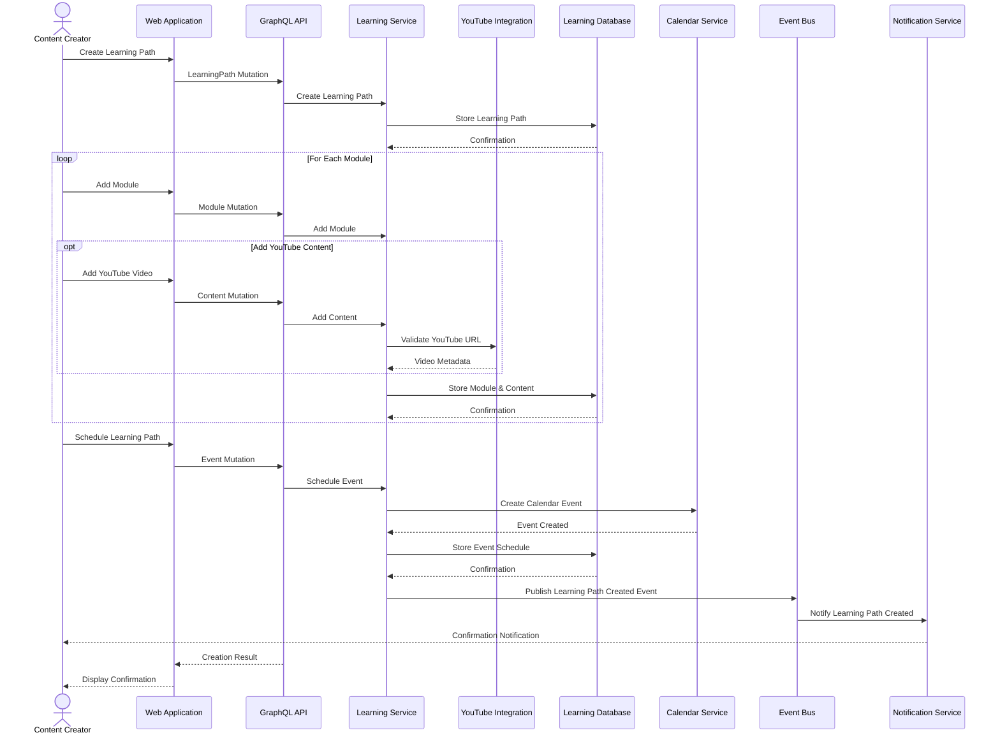

*This sequence diagram shows how a content creator builds a learning path, adding modules that may include YouTube content, and scheduling it as an event. The process involves multiple components including the Learning Service, YouTube integration, Calendar Service, and notification system.*

#### 3. Learning Path Enrollment Process

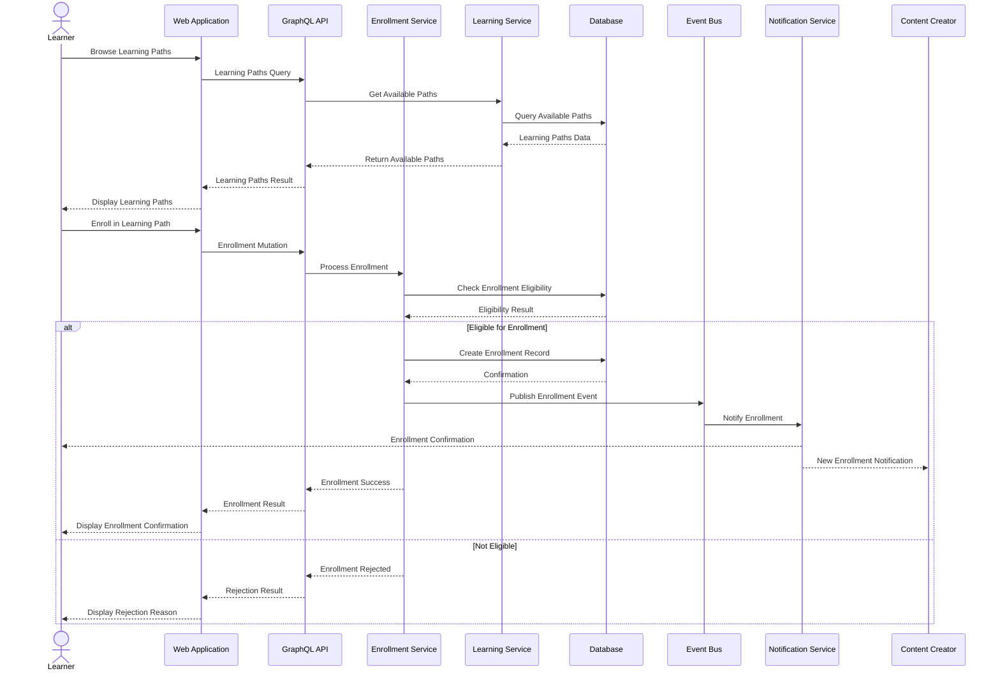

*This sequence diagram illustrates how learners browse available learning paths and enroll in them. The process includes checking eligibility, creating enrollment records, and notifying both the learner and the content creator.*

#### 4. Forum Discussion Process

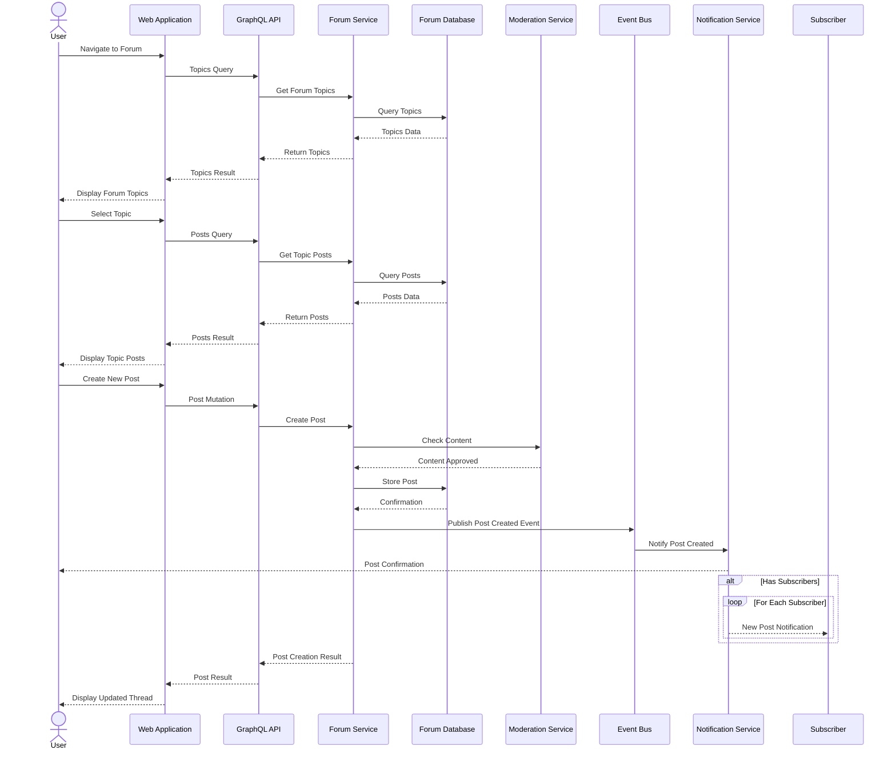

*This sequence diagram shows how users navigate the forum, view topics and posts, and create new posts. It includes content moderation checks and notifications to subscribers when new posts are created.*

#### 5. Certification Issuance Process

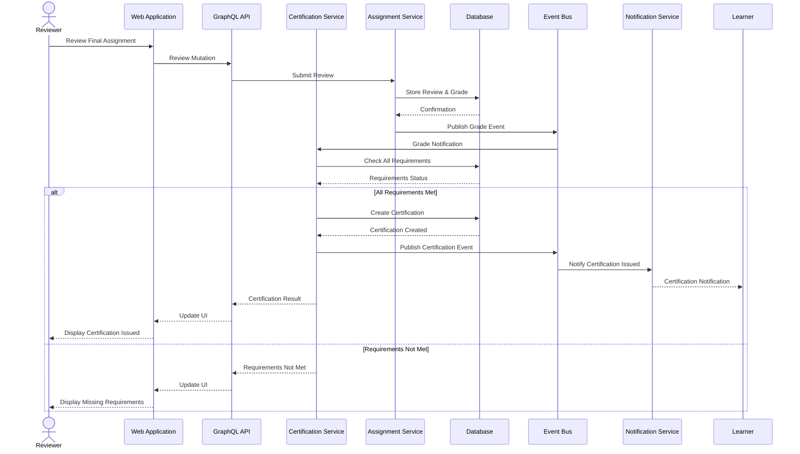

*This sequence diagram illustrates the process of certification issuance after a reviewer grades a final assignment. The system checks if all requirements are met and issues the certification accordingly, with appropriate notifications to the learner.*

### Thread Usage
The system uses the following threading models:
- **Web Application**: Single-threaded Blazor WebAssembly frontend running in the browser
- **API Layer**: Asynchronous request handling with managed thread pool
- **Microservices**: Task-based asynchronous pattern for non-blocking I/O operations
- **Background Processing**: Dedicated worker services for long-running tasks

### Inter-Process Communication
- **Client to API**: GraphQL over HTTPS
- **Service to Service**: Direct synchronous calls for critical path, event-based asynchronous messaging for non-critical operations
- **Service to Database**: Pooled database connections
- **Event Notifications**: Azure Service Bus for event-based communication

### Process Diagrams
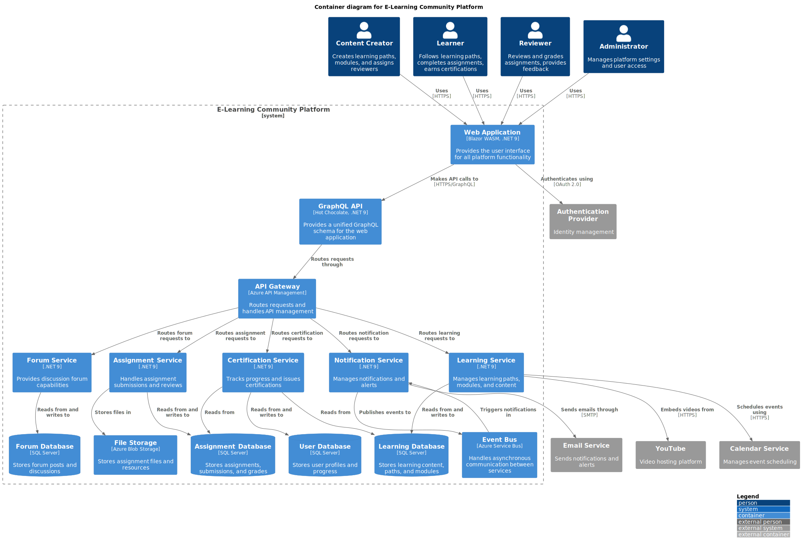

*This container diagram shows the major components of the system including the web application, GraphQL API, microservices, and data stores, illustrating how they interact with each other and with external systems.*

#### Container Diagram Detailed Description
The container diagram provides a comprehensive view of the E-Learning Community Platform's major components and their interactions, revealing the system's microservice architecture and communication patterns.

At the top level, four different user types (Content Creator, Learner, Reviewer, and Administrator) interact with the system through two client applications:
- A Blazor WebAssembly Web Application that runs in the browser
- A mobile app alternative (not the primary focus)

These client applications communicate exclusively through a unified GraphQL API, which serves as the central entry point for all client requests. This GraphQL API is positioned behind an API Gateway that provides routing and management capabilities.

The diagram reveals a well-structured microservices architecture with five specialized services:
1. **Learning Service** - Manages learning paths, modules, and content
2. **Assignment Service** - Handles assignment submissions and reviews
3. **Forum Service** - Provides discussion forum capabilities
4. **Certification Service** - Tracks progress and issues certifications
5. **Notification Service** - Manages user notifications and alerts

Each service maintains its own dedicated database to ensure domain isolation:
- Learning Database - Stores learning paths and content
- Assignment Database - Stores assignments and submissions
- Forum Database - Stores discussion threads and posts
- User Database - Stores user profiles and progress

The diagram shows the clear separation of data stores, with domain-specific databases for each service. Additionally, it includes:
- File Storage for assignment submissions and learning resources
- An Event Bus that enables asynchronous communication between services

The system integrates with four external services:
- YouTube for video content
- Calendar Service for scheduling
- Email Service for notifications
- Authentication Provider for identity management

Communication patterns illustrated in the diagram reveal:
1. A consistent API-first approach with all client communication through GraphQL
2. Clear service boundaries with specific responsibilities
3. Event-driven architecture for cross-service notifications
4. Specialized storage solutions for different types of data

This architecture supports the scalability and maintainability goals by allowing independent development and deployment of services while maintaining a unified API for clients.

## Development View
The development view describes the system from a programmer's perspective.

### Module Organization
The system is organized into the following major modules:
- **Client Application**: Blazor WebAssembly project
- **GraphQL API**: Hot Chocolate GraphQL API project
- **Domain Services**: Core business logic services
- **Data Access**: Repository implementations and database contexts
- **Shared**: Common models, DTOs, and utilities
- **Infrastructure**: Cross-cutting concerns like logging, caching, and messaging

### Common Design Patterns
- **CQRS**: Command Query Responsibility Segregation for operation separation
- **Repository Pattern**: For data access abstraction
- **Mediator Pattern**: For decoupling request handlers from controllers
- **Circuit Breaker Pattern**: For resilient external service integration
- **Specification Pattern**: For encapsulating complex query criteria

### Data Mapping Strategy
The system employs a clear data mapping strategy to ensure separation of concerns:

#### Mapping Principles
- **Domain Isolation**: Domain models are isolated from external contracts
- **DTO Pattern**: Data Transfer Objects for API communication
- **Explicit Mapping**: No implicit mapping between layers
- **Automapper Usage**: For repetitive, simple mappings
- **Immutable View Models**: Read models are immutable when possible

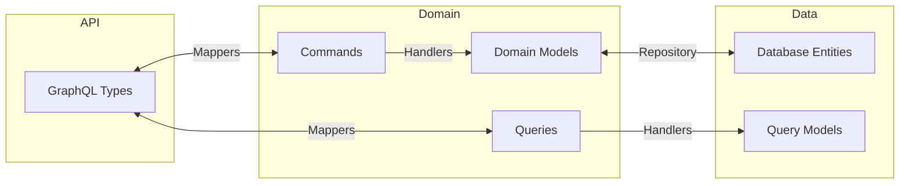

*This diagram illustrates the data flow and mapping strategy between different layers of the system.*

#### Data Mapping Tables

##### GraphQL to Domain Mappings

| Source Field | Target Field | Transformation |
|-------------|-------------|----------------|
| `LearningPathInput.title` | `CreateLearningPathCommand.Title` | Direct mapping with validation |
| `LearningPathInput.description` | `CreateLearningPathCommand.Description` | Direct mapping with HTML sanitization |
| `LearningPathInput.modules` | `CreateLearningPathCommand.Modules` | Transform into strongly-typed collection |
| `AssignmentInput.dueDate` | `CreateAssignmentCommand.DueDate` | Parse to DateTime and validate |
| `UserInput.email` | `RegisterUserCommand.Email` | Validate email format |

##### Domain to Entity Mappings

| Source Field | Target Field | Type | Description |
|-------------|-------------|------|-------------|
| `LearningPath.Id` | `LearningPathEntity.Id` | `Guid` | Domain ID to storage ID |
| `LearningPath.Title` | `LearningPathEntity.Title` | `string` | Direct mapping |
| `LearningPath.Modules` | `ModuleEntity` collection | `ICollection<ModuleEntity>` | Split into separate entities |
| `Assignment.SubmissionOptions` | `AssignmentEntity.SubmissionOptionsJson` | `string` | Serialize options to JSON |

#### Benefits
- Decouples layers, allowing independent evolution
- Simplifies contract versioning
- Improves testability
- Prevents domain logic leakage across boundaries
- Provides clear transformation documentation

### Development Standards
- C# code follows Microsoft's standard C# coding conventions
- GraphQL schema follows GraphQL best practices
- Blazor components follow component design best practices
- Test coverage minimum: 80% for business logic, 60% for UI components
- All public APIs must be documented with XML comments
- Code quality enforced through analyzers and pull request reviews

### Package Diagrams
Component structure follows a layered architecture pattern:
- Presentation Layer (Blazor WASM)
- API Layer (GraphQL)
- Service Layer (Business Logic)
- Data Access Layer (Repositories)

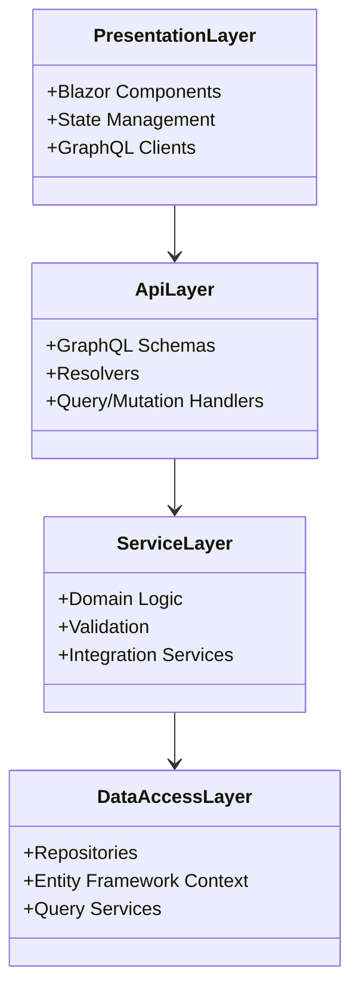

*This class diagram shows the layered architecture of the system, with clear separation of concerns between presentation, API, service, and data access layers.*

## Physical View
The physical view maps software to hardware infrastructure.

### Deployment Topology
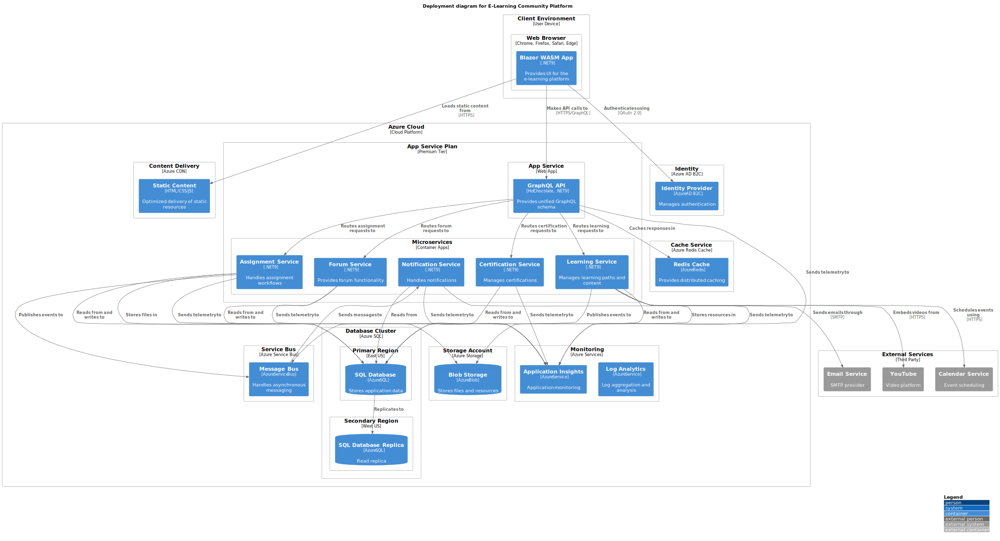

*This deployment diagram shows how the E-Learning Community Platform components are deployed on Azure cloud infrastructure, including web applications, APIs, microservices, and databases.*

#### Deployment Diagram Detailed Description
The deployment diagram provides a detailed view of how the E-Learning Community Platform is physically deployed across infrastructure components, illustrating the Azure cloud architecture that supports the system.

At the client level, the diagram shows two main access patterns:
1. **Web Browsers** on client devices running the Blazor WebAssembly application
2. The application loads static content from Azure CDN for optimized delivery

The core of the system is deployed in the Azure Cloud with a sophisticated multi-service architecture:
- **Content Delivery** through Azure CDN for static assets, improving global performance
- **App Service Plan** hosting:
  - The GraphQL API in an App Service instance
  - Microservices deployed as Container Apps (Learning, Assignment, Forum, Certification, and Notification services)
- **Database Cluster** utilizing Azure SQL with:
  - Primary database in the East US region
  - Secondary read replica in the West US region for redundancy and read scaling
- **Storage Account** with Blob Storage for files and learning resources
- **Service Bus** for asynchronous message handling between services
- **Redis Cache** for distributed caching to improve performance
- **Identity Service** using Azure AD B2C for authentication
- **Monitoring** through Application Insights and Log Analytics

The diagram reveals several important infrastructure patterns:
1. **Geographic Distribution** - Database replication across regions for resilience
2. **Layered Security** - Authentication, authorization, and network security controls
3. **Performance Optimization** - CDN for static content, Redis for caching
4. **Scalability** - Container-based microservices that can scale independently
5. **Monitoring** - Comprehensive telemetry collection across all services

Communication patterns shown in the diagram include:
- Client-to-API communication over HTTPS/GraphQL
- Service-to-service communication within the Azure network
- Integration with external services (YouTube, Calendar, Email)
- Telemetry flows to monitoring services

This deployment architecture supports the non-functional requirements of scalability, availability, and performance while providing a secure and maintainable infrastructure that aligns with cloud-native best practices.

### Infrastructure Requirements
- **Client Tier**: Modern web browsers with WebAssembly support
- **Web Tier**: Azure App Service or Container Apps for hosting
- **API Tier**: Azure App Service or Container Apps for hosting
- **Service Tier**: Azure Container Apps for microservices
- **Data Tier**: Azure SQL Database for relational data
- **Storage**: Azure Blob Storage for files and resources
- **Messaging**: Azure Service Bus for event-based communication
- **Identity**: Azure AD B2C for authentication and authorization
- **Caching**: Azure Redis Cache for distributed caching
- **Monitoring**: Azure Application Insights and Log Analytics

### Deployment Strategy
The system is deployed using the following multi-environment strategy:

```mermaid
flowchart LR
    Dev[Development] --> Test[Testing]
    Test --> Staging[Staging]
    Staging --> Production[Production]
    
    subgraph "CI/CD Pipeline"
        Dev
        Test
    end
    
    subgraph "Pre-Production"
        Staging
    end
    
    subgraph "Production"
        Production
        DR[Disaster Recovery]
    end
    
    Production -- Replication --> DR
```

*This flowchart illustrates the deployment pipeline from development through testing, staging, and production, with disaster recovery capabilities.*

Key aspects of the deployment strategy:
- **Infrastructure as Code**: Azure Resource Manager templates
- **Container-Based Deployment**: Docker containers for consistent deployment
- **CI/CD Pipeline**: Azure DevOps for build and deployment automation
- **Blue/Green Deployments**: For zero-downtime updates
- **Database Migrations**: Automated with deployment safety checks
- **Geo-Redundancy**: Multi-region deployment for high availability

## Size and Performance
### Response Time
- Web application initial load: < 2 seconds
- API response time: < 200ms for 95% of requests
- Page navigation: < 300ms
- Assignment submission: < 3 seconds including file upload
- Search operations: < 500ms

### Throughput
- Support for 5,000 concurrent users
- Handle up to 100 assignment submissions per minute
- Process up to 1,000 API requests per second
- Support up to 10,000 daily active users

### Capacity
- Store up to 10TB of learning content and submissions
- Support up to 100,000 registered users
- Manage up to 5,000 active learning paths
- Handle up to 50,000 forum posts per month
- Store up to 1 million assignment submissions

### Resource Utilization
- Target CPU utilization: < 70% under peak load
- Memory usage: Optimized for minimal footprint
- Network bandwidth: < 50Mbps average, with burst capacity to 500Mbps
- Database IOPS: < 5,000 operations per second under normal load

## Quality Attributes
### Security
- **Authentication**: OAuth 2.0 with OpenID Connect via Azure AD B2C
- **Authorization**: Role-based and claim-based access control
- **Data Protection**: Encryption at rest and in transit
- **Input Validation**: Server-side validation of all inputs
- **CSRF Protection**: Anti-forgery measures for all state-changing operations
- **Content Security**: Sanitization of user-generated content
- **Audit Logging**: Comprehensive logging of security-relevant events

### Scalability
- **Horizontal Scaling**: Add instances to handle increased load
- **Database Partitioning**: Sharding strategy for large datasets
- **Stateless Services**: Facilitate scaling and load balancing
- **Caching Strategy**: Multi-level caching to reduce database load
- **Async Processing**: Background processing for resource-intensive operations

### Reliability & Availability
- **Target Availability**: 99.9% uptime (Three Nines)
- **Fault Tolerance**: Graceful degradation of functionality
- **Data Redundancy**: Geo-redundant storage for critical data
- **Circuit Breakers**: Prevent cascade failures with external dependencies
- **Retry Policies**: Intelligent retry for transient failures
- **Monitoring**: Real-time monitoring with alerting
- **Disaster Recovery**: Recovery point objective (RPO) of 15 minutes, recovery time objective (RTO) of 1 hour

### Maintainability
- **Modular Architecture**: Independent components with clear interfaces
- **Coding Standards**: Consistent coding style and practices
- **Documentation**: Comprehensive API and code documentation
- **Testing**: Automated tests at unit, integration, and UI levels
- **Dependency Management**: Clear versioning and dependency strategy
- **Feature Flags**: Controlled feature rollout and emergency disabling

### Interoperability
- **GraphQL API**: Standardized API for all client interactions
- **OAuth Integration**: Standard authentication flows
- **YouTube API**: Standard integration with YouTube Data API
- **Calendar Integration**: Support for iCalendar standards
- **Content Export**: Support for common export formats

## References
- .NET 9 Documentation: https://docs.microsoft.com/en-us/dotnet/
- Blazor Documentation: https://docs.microsoft.com/en-us/aspnet/core/blazor/
- Hot Chocolate GraphQL: https://chillicream.com/docs/hotchocolate/
- Azure Documentation: https://docs.microsoft.com/en-us/azure/
- C4 Model: https://c4model.com/
- GraphQL Specification: https://spec.graphql.org/

## Appendices
### Appendix A: Decision Records
#### ADR 1: GraphQL API vs REST
Selected GraphQL for the API layer because:
- Flexible query capabilities reduce over-fetching and under-fetching
- Strong typing and schema benefits align with .NET type system
- Hot Chocolate provides excellent .NET integration
- Reduces number of endpoints and simplifies versioning
- Better supports the complex, interconnected nature of learning content

#### ADR 2: Blazor WebAssembly vs Server
Selected Blazor WebAssembly because:
- Provides better offline capabilities for learning content
- Reduces server load for rendering
- Better suited for interactive UI components
- Allows for client-side state management
- Enables progressive web app (PWA) capabilities

#### ADR 3: Microservices Architecture
Adopted a microservices approach because:
- Allows independent scaling of different system components
- Enables focused development by separate teams
- Provides isolation for different functional domains
- Supports different technology choices where appropriate
- Facilitates incremental updates and deployment

#### ADR 4: Azure SQL vs Cosmos DB
Selected Azure SQL Database because:
- Relational nature of the data (users, learning paths, modules, etc.)
- Strong consistency requirements for educational records
- Better support for complex queries needed for reporting
- Team's existing expertise with SQL
- Cost efficiency for predictable workloads

### Appendix B: Risk Assessment
| Risk | Impact | Likelihood | Mitigation |
|------|--------|------------|------------|
| Performance issues with Blazor WASM | High | Medium | Performance testing early, lazy loading, optimized assets |
| GraphQL query complexity | Medium | Medium | Query complexity analysis, rate limiting, depth limiting |
| Data integrity across microservices | High | Medium | Saga pattern for distributed transactions, eventual consistency where appropriate |
| Security vulnerabilities | High | Medium | Regular security audits, penetration testing, OWASP guidelines |
| Scalability bottlenecks | Medium | Low | Load testing, performance benchmarking, design reviews |

### Appendix C: Performance Test Results
Initial load testing indicates:
- GraphQL API can handle 2,000 requests/second with 95th percentile latency under 200ms
- Blazor WebAssembly initial load time averages 1.8 seconds on typical connections
- Database can handle up to 3,000 operations per second before performance degradation
- Assignment submission with 10MB file upload completes in 2.7 seconds average
