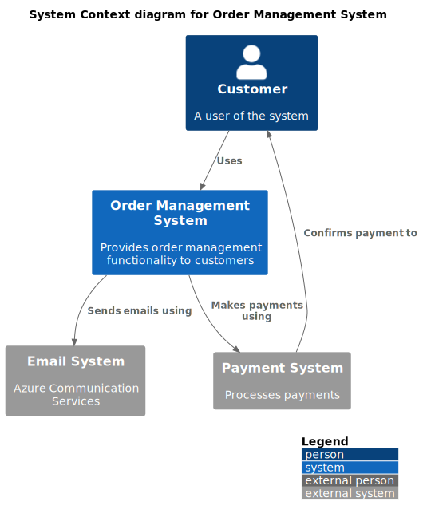
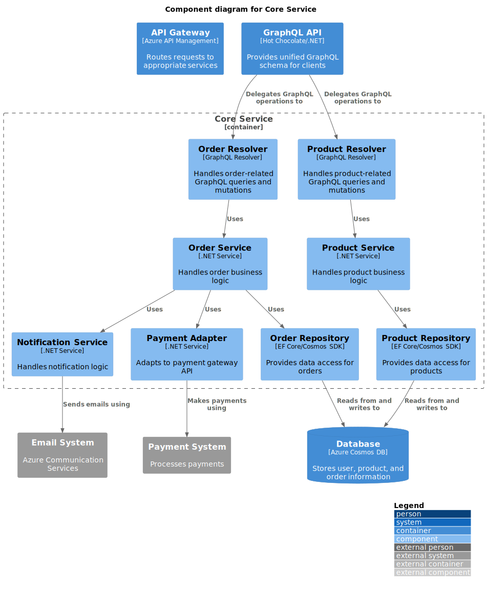
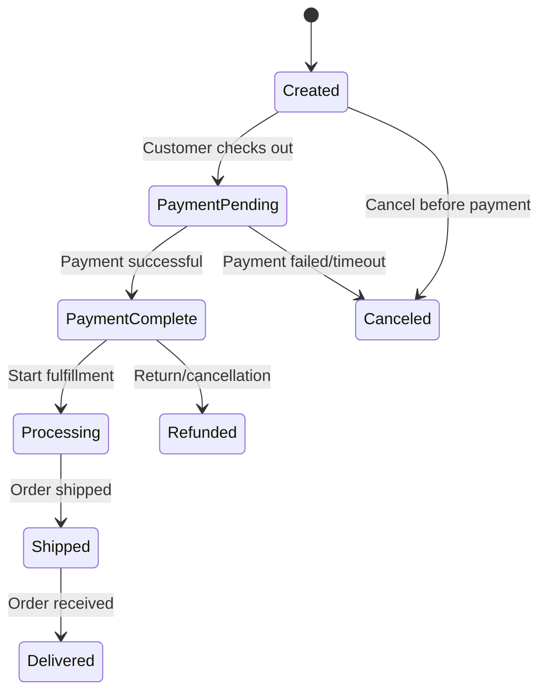
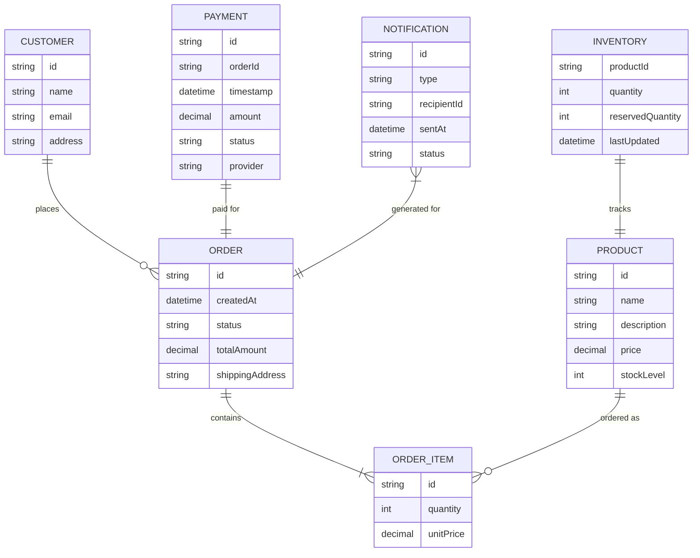
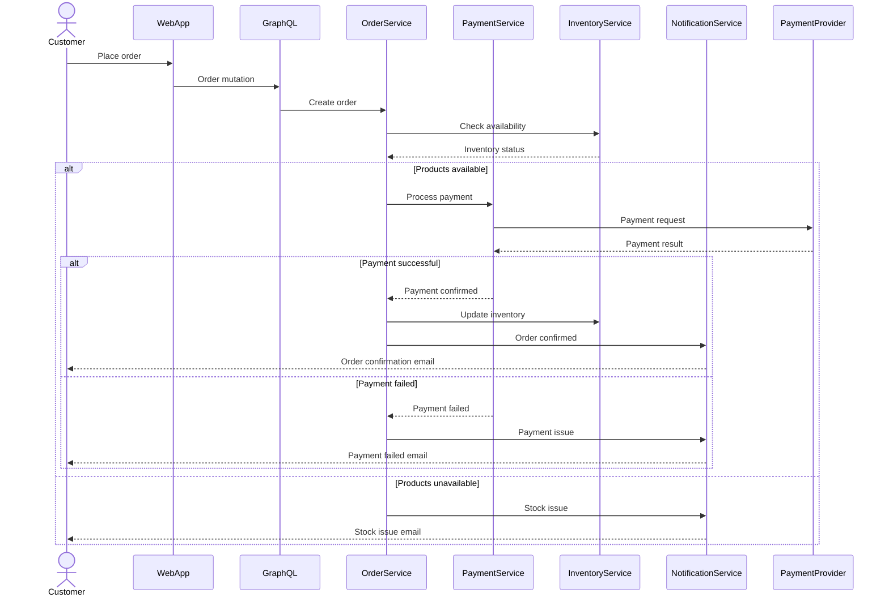
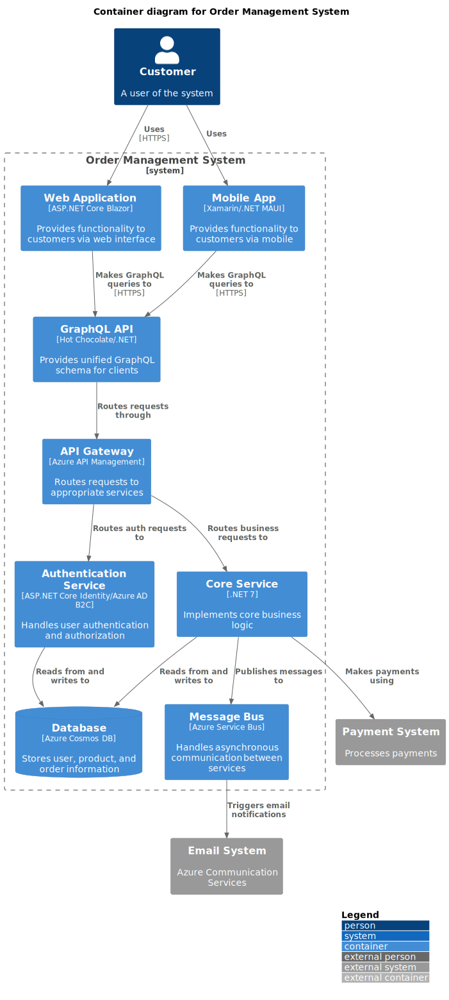
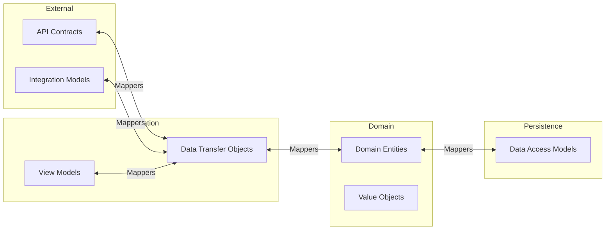
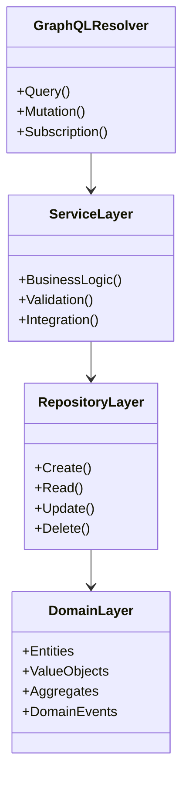
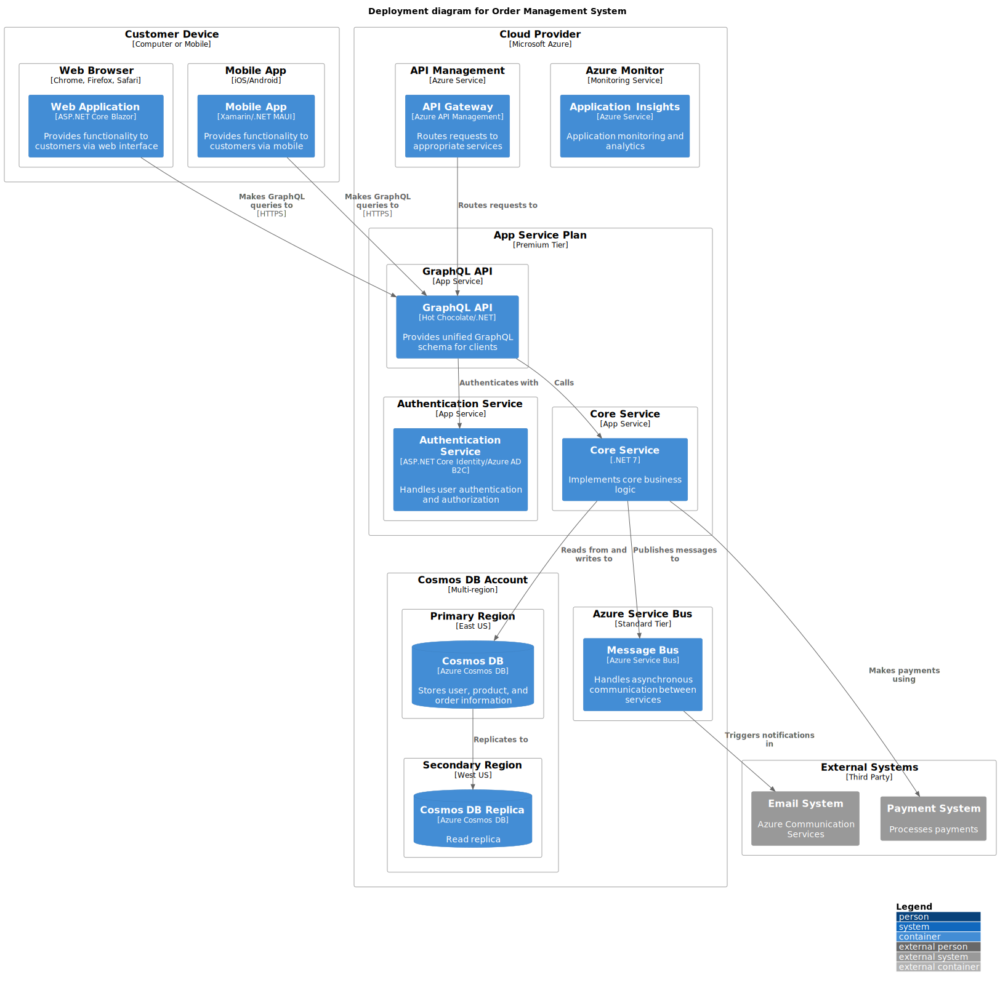
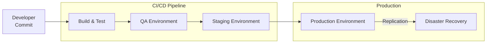

# Software Architecture Document: Order Management System

## Document Information
- **Project Name**: Order Management System (OMS)
- **Document Version**: 1.0
- **Last Updated**: 2023-11-01
- **Prepared By**: Architecture Team
- **Status**: Draft

## Table of Contents
1. [Introduction](#introduction)
2. [Architectural Representation](#architectural-representation)
3. [Architectural Goals and Constraints](#architectural-goals-and-constraints)
4. [Use Case View ("+1" View)](#use-case-view)
5. [Logical View](#logical-view)
6. [Process View](#process-view)
7. [Development View](#development-view)
8. [Physical View](#physical-view)
9. [Size and Performance](#size-and-performance)
10. [Quality Attributes](#quality-attributes)
11. [References](#references)

## Introduction
### Purpose
This document provides a comprehensive architectural overview of the Order Management System (OMS), using different architectural views to depict different aspects of the system. It is intended for technical stakeholders including software architects, developers, testers, and operations personnel.

### Scope
This document covers the architecture of the Order Management System, including its core components, interfaces, and external integrations. It includes the order processing workflow, product management, payment processing, and notification services. It does not cover detailed implementation-level designs or third-party system internals.

### Definitions, Acronyms, and Abbreviations
- **OMS**: Order Management System
- **API**: Application Programming Interface
- **GraphQL**: Query language for APIs and runtime for executing those queries
- **EF Core**: Entity Framework Core
- **AKS**: Azure Kubernetes Service
- **AVM**: Azure Virtual Machine
- **App Service**: Azure App Service

### References
- OMS Requirements Specification v1.2
- Payment Gateway Integration Specification
- Email Service API Documentation
- .NET Core Documentation
- GraphQL Hot Chocolate Documentation (https://chillicream.com/docs/hotchocolate)
- C4 Model Documentation (https://c4model.com/)

### Overview
This document provides architectural views of the OMS using the 4+1 View Model. It includes use case, logical, process, development, and physical views of the system architecture.

## Architectural Representation
This architecture document follows the 4+1 Architectural View Model by Philippe Kruchten:
- **Logical View**: Describes the functional requirements - what the system should provide
- **Process View**: Addresses concurrency and distribution aspects
- **Development View**: Focuses on the organization of modules and components
- **Physical View**: Maps software to hardware and addresses non-functional requirements
- **Scenarios (Use Case View)**: The "+1" view that ties together the other four views

Each view is designed to address the concerns of different stakeholders in the system development process.

## Architectural Goals and Constraints
The architecture of the OMS is designed to meet the following goals:

### Goals
- Provide a scalable platform that can handle peak order volumes during sale events
- Support real-time inventory updates and order processing
- Enable seamless integration with third-party payment processors
- Support multiple client interfaces (web, mobile)
- Allow for future expansion to new markets and product categories

### Constraints
- Must maintain compliance with data protection regulations
- Must integrate with existing legacy warehouse management systems
- Development timeline restricted to six months for initial release
- Budget constraints require use of cloud services with minimal upfront costs
- Must support 99.9% uptime SLA

## Use Case View ("+1" View)
The use case view represents the key scenarios that the OMS must support.

### Key Use Cases
1. **Place Order**: Customer browses products, adds items to cart, and completes checkout
2. **Process Payment**: System processes payment through a payment gateway
3. **Manage Inventory**: System updates inventory levels in response to orders
4. **Track Order**: Customer views status of their order
5. **Cancel Order**: Customer or admin cancels an order before shipping
6. **Generate Reports**: Admin generates sales and inventory reports
7. **Manage Products**: Admin adds, updates, or removes products from catalog

### Use Case Diagrams

*The context diagram shows how the OMS interacts with external users and systems.*

## Logical View
The logical view describes the key functional elements of the OMS.

### Overview
The OMS follows a microservices architecture with clearly defined service boundaries. Core services include Order Service, Product Service, Payment Service, Notification Service, and User Service. Each service is responsible for its own domain data and business logic.

### Package/Component Architecture
The system is organized into the following key components:
- **API Gateway**: Routes requests to appropriate services
- **GraphQL API**: Implements the GraphQL schema with Hot Chocolate
- **Core Services**: Implements core business logic in .NET C#
- **Authentication Service**: Manages user authentication and authorization with Azure AD B2C
- **Database**: Stores system data (orders, products, users)

### Important Class Diagrams

*The component diagram shows the internal structure of the Core Service and its relationships with other components.*

### State Machine Diagrams
Order status transitions:
1. Created → Payment Pending → Payment Complete → Processing → Shipped → Delivered
2. Alternative paths: Created → Canceled, Payment Pending → Canceled, Payment Complete → Refunded

### Data Model
Key entities in the OMS include:
- Order (with OrderItems)
- Product
- Customer
- Payment
- Notification
- Inventory

## Process View
The process view describes the system's dynamic aspects.

### Process Description
The order fulfillment process involves several steps:
1. Order placement triggers validation of product availability
2. Payment processing occurs asynchronously with payment provider
3. Upon successful payment, inventory is updated
4. Order fulfillment process is initiated in the warehouse system
5. Customer receives notifications at key stages of the process

### Thread Usage
- API endpoints handle requests synchronously
- Long-running operations like payment processing and email notifications are handled asynchronously using message queues
- Background jobs process reports and reconciliation tasks

### Inter-Process Communication
- GraphQL API for service-to-client and service-to-service communication
- Azure Service Bus for asynchronous event-based communication
- Azure Redis Cache for caching and distributed locking

### Process Diagrams

*The container diagram illustrates how the different containers (applications and data stores) within the OMS interact.*

## Development View
The development view describes the system from a programmer's perspective.

### Module Organization
The OMS codebase is organized into the following modules:
- `ApiGateway` - API Gateway implementation using Azure API Management
- `Identity` - Authentication service using Azure AD B2C
- `Orders` - Order management
- `Products` - Product catalog and inventory
- `Payments` - Payment processing
- `Notifications` - Email and push notifications
- `Common` - Shared libraries and utilities

### Common Design Patterns
- Repository Pattern for data access with Entity Framework Core
- Adapter Pattern for external system integration
- CQRS for separating read and write operations
- Mediator Pattern using MediatR
- Circuit Breaker for resilient communication using Polly

### Data Mapping Strategy
The system employs a comprehensive data mapping strategy to ensure loose coupling between layers and components:

#### Mapping Principles
- **Separation of Concerns**: Domain models are kept separate from DTOs, ViewModels, and external API contracts
- **Layer Isolation**: Each architectural layer defines its own data model appropriate for its responsibilities
- **Single Responsibility**: Dedicated mapper classes for transformations between different data representations
- **Immutability**: Data transfer objects are designed to be immutable where appropriate

#### Implementation Approach
- **AutoMapper**: Used for straightforward property mappings between object types
- **Explicit Mappers**: Custom mapping logic implemented for complex transformations
- **Extension Methods**: Fluent mapping methods for frequently used transformations
- **Mapping Profiles**: Centralized configuration of mapping rules by bounded context

#### Mapping Examples

##### Domain Entity to DTO Mappings

| Domain Entity Field | DTO Field | Transformation |
|---------------------|-----------|----------------|
| `Order.Id` | `OrderDto.Id` | Convert Guid to string |
| `Order.Customer.Name` | `OrderDto.CustomerName` | Flatten nested object |
| `Order.Customer.Email` | `OrderDto.CustomerEmail` | Flatten nested object |
| `Order.Items` | `OrderDto.Items` | Map collection of OrderItems to OrderItemDtos |
| `Order.Status` | `OrderDto.Status` | Convert enum to string |
| `Order.TotalAmount.Amount` | `OrderDto.TotalAmount` | Extract decimal value from Money value object |
| `Order.TotalAmount.Currency` | `OrderDto.CurrencyCode` | Extract currency code from Money value object |
| `Order.ShippingAddress` | `OrderDto.ShippingAddress` | Map Address to AddressDto |
| `Order.CreatedAt` | `OrderDto.CreatedAt` | Direct mapping |

##### DTO to GraphQL Type Mappings

| DTO Field | GraphQL Field | Type | Description |
|-----------|---------------|------|-------------|
| `OrderDto.Id` | `id` | `ID!` | The unique identifier of the order |
| `OrderDto.CustomerName` | `customerName` | `String!` | The name of the customer who placed the order |
| `OrderDto.CustomerEmail` | `customerEmail` | `String!` | The customer's email address |
| `OrderDto.Items` | `items` | `[OrderItem!]!` | The items included in the order |
| `OrderDto.Status` | `status` | `OrderStatus!` | The current status of the order |
| `OrderDto.TotalAmount` | `totalAmount` | `Decimal!` | The total monetary amount of the order |
| `OrderDto.CurrencyCode` | `currencyCode` | `String!` | ISO currency code for the order |
| `OrderDto.ShippingAddress` | `shippingAddress` | `Address` | The shipping destination |
| `OrderDto.CreatedAt` | `createdAt` | `DateTime!` | When the order was created |
| N/A | `isShipped` | `Boolean!` | Computed field based on status |

##### Complex Mapping Example: Order Summary View

| Source Fields | Target Field | Transformation Logic |
|---------------|-------------|----------------------|
| `Order.CreatedAt`, `Order.Id` | `OrderSummary.OrderReference` | Format as `ORD-{year}-{first 8 chars of ID}` |
| `Order.Customer.Name`, `Order.Customer.Email` | `OrderSummary.CustomerDetails` | Create CustomerDetails object |
| `Order.Customer.CustomerLevel` | `OrderSummary.CustomerDetails.IsVip` | Convert level to boolean based on threshold |
| `Order.Status` | `OrderSummary.Status` | Map using custom status grouping logic |
| `PaymentInfo.Status` | `OrderSummary.PaymentStatus` | Direct mapping with null handling |
| `ShipmentTracking.TrackingNumber` | `OrderSummary.TrackingNumber` | Direct mapping with null handling |
| `ShipmentTracking.ProviderId`, `ShipmentTracking.TrackingNumber` | `OrderSummary.TrackingUrl` | Format as tracking URL if provider exists |
| `Order.ShippingAddress` | `OrderSummary.ShippingAddress.FormattedAddress` | Format address based on country format rules |

#### Benefits
- Prevents tight coupling between system layers
- Allows independent evolution of domain models and external contracts
- Simplifies API versioning and backward compatibility
- Enables optimized data structures for specific use cases (read vs. write)
- Improves testability by isolating concerns

### Development Standards
- C# coding standards follow Microsoft's guidelines
- GraphQL API design follows GraphQL best practices
- API documentation with GraphQL introspection and Banana Cake Pop
- Test coverage minimum of 80% for all code using xUnit
- Git workflow: feature branches with pull requests

### Package Diagrams
Component structure follows a layered architecture pattern:
- Controller Layer (GraphQL APIs)
- Service Layer (Business Logic)
- Repository Layer (Data Access)
- Domain Layer (Entity Objects)

## Physical View
The physical view maps software to hardware infrastructure.

### Deployment Topology

*The deployment diagram shows how the OMS components are deployed to physical infrastructure.*

### Infrastructure Requirements
- Web and API servers: Azure App Service or AKS
- Databases: Azure SQL Database with geo-replication
- Message Queue: Azure Service Bus
- Caching: Azure Redis Cache
- Storage: Azure Blob Storage for product images and reports
- CDN: Azure CDN for static content delivery

### Deployment Diagram
The OMS is deployed on Azure using containerized microservices orchestrated with AKS:
- Multiple regions for high availability
- Blue-green deployment strategy for zero-downtime updates
- Database primary-replica setup for failover

### Deployment Strategy
The system is deployed using a continuous delivery pipeline with automated testing and deployment stages.

## Size and Performance
### Response Time
- Web page load time: < 2 seconds
- API response time: < 200ms for 95% of requests
- Order confirmation: < 3 seconds after payment approval

### Throughput
- Support for 1000 concurrent users
- Process up to 100 orders per second during peak hours
- Handle 10,000 product catalog queries per minute

### Capacity
- Store up to 1 million products
- Handle 100,000 orders per day
- Support up to 1 million registered users
- Store order history for 7 years for compliance

### Resource Utilization
- Target CPU utilization: 60-70% under normal load
- Database storage growth: approximately 50GB per month
- Network bandwidth: 100Mbps minimum, with bursting capability to 1Gbps

## Quality Attributes
### Security
- All communications secured via TLS 1.2+
- Authentication using OAuth 2.0 and JWT
- Role-based access control for administrative functions
- PCI DSS compliance for payment card handling
- Regular security audits and penetration testing

### Scalability
- Horizontal scaling of all services through containerization
- Database read scaling through read replicas
- Caching for frequently accessed data
- Asynchronous processing for non-critical operations

### Reliability & Availability
- System availability target: 99.9% uptime
- Automated failover for all critical components
- Retry mechanisms for transient failures
- Daily database backups with point-in-time recovery
- Comprehensive monitoring and alerting

### Maintainability
- Microservices architecture enables independent service updates
- API versioning strategy for backward compatibility
- Comprehensive logging and monitoring
- Automated testing pipeline
- Infrastructure as Code for reproducible deployments

### Interoperability
- GraphQL API with standard schema
- GraphQL subscriptions for real-time updates
- WebHooks for external system integration
- Support for standard authentication protocols

## References
- .NET Documentation: https://docs.microsoft.com/en-us/dotnet/
- Azure Architecture Center: https://docs.microsoft.com/en-us/azure/architecture/
- GraphQL Hot Chocolate: https://chillicream.com/docs/hotchocolate
- C4 Model: https://c4model.com/
- Microservices with .NET: https://docs.microsoft.com/en-us/dotnet/architecture/microservices/

## Appendices
### Appendix A: Decision Records
Key architectural decisions and their rationales are documented in Architecture Decision Records (ADRs) in the project repository.

### Appendix B: Risk Assessment
Detailed analysis of architectural risks and mitigation strategies.

### Appendix C: Performance Test Results
Summary of performance benchmarks from the testing environment.
